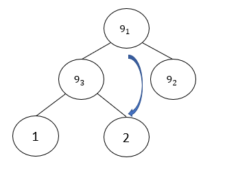
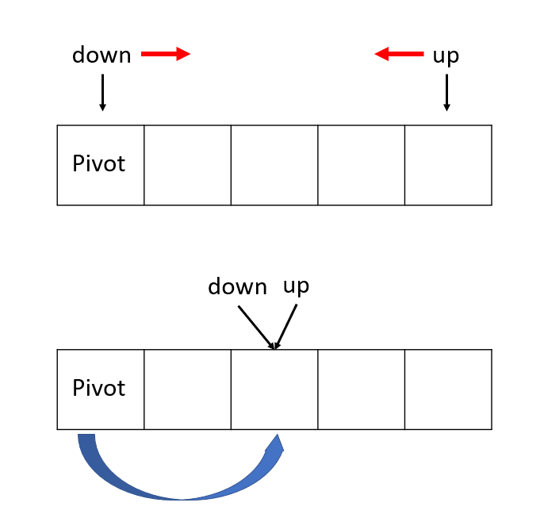
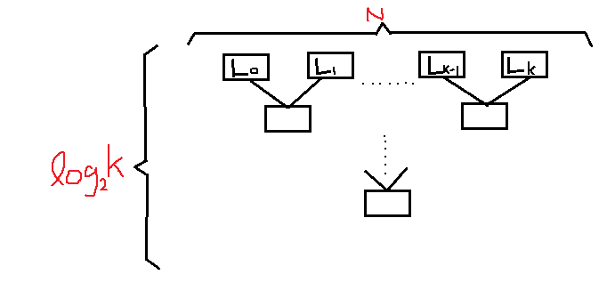

# Algorithmics Homework 1
###### tags: `report` `algorithm`
```
第 7 組
資工二B 109502546 劉語芯
資工二B 109502549 徐瑄琳
資工二B 109502550 許筱敏
資工二B 109502551 葉容瑄
資工二B 109502564 林奕辰
資管二A 109403020 王廷傑
```

### Problem 1
:::info
Prove that each of the following sorting algorithms is stable or show that it is unstable by giving a counter example; moreover, determine whether it is in place: 
bubble sort, insertion sort, quick sort, merge sort, heap-sort
:::

For giving an example array $9_1,1,9_2,9_3,2$

- bubble sort(front>behind,then interchange)
1st: $1,9_1,9_2,2,9_3$
2nd: $1,9_1,2,9_2,9_3$
3rd: $1,2,9_1,9_2,9_3$
- insertion sort(front>behind,then interchange)
1st: $9_1,(1,9_2,9_3,2)$
2nd: $1,9_1,(9_2,9_3,2)$
3rd: $1,9_1,9_2,(9_3,2)$
4th: $1,9_1,9_2,9_3,(2)$
5th: $1,2,9_1,9_2,9_3$
- merge sort:
1st: $(1,9_1),(9_2,9_3),(2)$
2nd: $(1,9_1,9_2,9_3),(2)$
3rd: $1,2,9_1,9_2,9_3$
<!--
stable 我不知道怎麼證才正確0.0(這個殼以說是直接證明法ㄇ)先放著
上網查到ㄉ 看起來也像是直接證明
How would one prove this? Formally, you would use #proof of correctness methods.# You might start with an set of elements V_i for 0<= i < N.
Then define
value(i) to be the “value” used to sort the elements of V_i
orig(i) to be the index in the array at the start of the algorithm for element V_i
current(i) to be the index in the array at the current moment of V_i, and
final(i) to be the index in the array of V_i at the end of computation.
For each pass through the loop, you will want to prove that
For all i, j, (value(i) == value(j) & orig(i) < orig(j)) => (current(i) < current(j))
Each time through the loop, this needs to be true, and for most stable sorting algorithms it is true. I’m leaving this as an exercise.
We then observe that at the end of computation final(i) == current(i) for all i.

如何證明這一點？ 形式上，您將使用正確性證明方法。 您可以從一組元素 V_i 開始，即 0<= i < N。
然後定義
value(i) 是用於對 V_i 的元素進行排序的“值”
orig(i) 作為元素 V_i 算法開始時數組中的索引
current(i) 為 V_i 當前時刻數組中的索引，並且
final(i) 是計算結束時 V_i 數組中的索引。
對於每次通過循環，您都需要證明
對於所有 i, j, (value(i) == value(j) & orig(i) < orig(j)) => (current(i) < current(j))
每次通過循環，這都必須是真的，並且對於大多數穩定的排序算法來說都是真的。 我把這個作為練習。
然後我們觀察到，在計算結束時，所有 i 的 final(i) == current(i)。 
-->

- heap sort
the heap array will be: $9_1,9_3,9_2,1,2$
1st: $9_3,2,9_2,1,(9_1)$
In the first exchange,since the last one($9_1$) is fixed,we can know heap sort is unstable.



- quick sort
<!--這邊用另一個數列$9_1,1,9_2,10,2$說明，pivot為待排序列的第一個值。
    1. down指標前到後找>pivot的值 up指標後到前找<=pivot的值 
    2. if up在down的後面,up、down指的數字交換，回到第一個步驟
    3. else if up和down交叉,up指的數字和pivot換
        - 1st(pivot:$9_1$)：(down找到10 up找到2)，up、dwon交換。接著up-- down++，up<=down、up也就是2和$9_1$換)
So after the first sort:$(2,1,9_2),9_1,(10)$
We can observe that $9_1$ is fixed, $9_2$ is in front of $9_1$,so that quick sort is unstable. 

(全英文版不是晶晶體ㄌ)

-->
Another example array : $9_1,1,9_2,10,2$
The first number in the unsorted array will be the pivot.
Step1 :Repeatedly increase the pointer $down$ by one position until x[down]>pivot
Step2 :Repeatedly decrease the pointer $up$ by one position until x[up]<=pivot
Step3 :If up>down, inetrchange x[down] with x[up] and return to step 1
　　　Else if up<=down, x[up] interchange with pivot
The first sort with pivot $9_1$ : $(2,1,9_2),9_1,(10)$
We can observe that $9_1$ is fixed, $9_2$ is in front of $9_1$,so that quick sort is unstable. 


)


#### Conclusion
- stable: bubble, insertion, merge
  unstable: quick, heap
- in-place: bubble, insertion, heap
  not in-place: merge, quick (divide and conquer need space)


### Problem 2
:::info
Design a data structure to represent a set with elements being positive integers, and then design algorithms for the following operations: 
- Compute the union of two sets.
- Compute the intersection of two sets. 
- Determine if a given element is in a given set.
:::
#### Idea
- Consider two data structures, array and binary search tree(BST). Implementing with array, the time complexities of four operations (*insert, find, union, intersection*) are all $O(n)$. If we choose BST to represent a set, the time complexity of *insert* and *find* in average case will be $O(\log n)$. For *union* and *intersection*, the time complexity of two data structures are the same($O(n)$), but implementing with bst is more complex than implementing with array. Based on the above considerations, we choose **array** to represent the given set.
- if we search sorting array with binary search, we can reduce the time complexity of *find* to $O(\log n)$

#### Pseudocode
- *insert* with time complexity of $O(n)$
	```
	func insert(k): void
		n <- (1 + number of elements in arr)
		for(int i = n-1; i >= 0; i--)
			if arr[i] > k
				arr[i+1] <- arr[i]
			else
				arr[i] <- k
				break
			end if
		end for
	end func
	```
- *union* with time complexity of $O(m+n)$
	```
	func union(arr1, arr2): array
		i <- 0
		j <- 0
		while i < arr1.size() && j < arr2.size() do
			if arr1[i] < arr2[j]
				arr.insert(arr1[i])
				i++
			else if arr1[i] > arr2[j]
				arr.insert(arr2[j])
				j++
			else
				arr.insert(arr1[i])
				i++
				j++
			end if
		end while

		while i < arr1.size() do
			arr.insert(arr1[i])
			i++
		end while

		while j < arr2.size() do
			arr.insert(arr2[j])
			j++
		end while

		return arr
	end func
	```
- *intersection* with time complexity of $O(m+n)$
	```
	func intersection(arr1, arr2): array
		i <- 0
		j <- 0
		while i < arr1.size && j < arr2.size do
			if arr1[i] < arr2[j]
				i++
			else if arr1[i] > arr2[j]
				j++
			else
				arr.insert(arr1[i])
				i++
				j++
			end if
		end while
		return arr
	end func
	```
- *find* with time complexity of $O(n)$
	```
	func find(k): bool
		n <- number of elements in arr
		for (int i = 0; i < n; i++)
			if arr[i] == k
				return true
			else if arr[i] < k
				i++
			else
				return false
			end if
		end for

		return false
	end func
	```
- *find* with time complexity of $O(\log n)$
	```
	func find(key, arr): bool
		l <- 0
		r <- arr.size()
		while (l < r) do
			m <- (l + r) / 2
			if (key == arr[m])
				return true
			else if (key > arr[m])
				l <- m+1
			else
				r <- m
			end if
		end while
		return false
	end func
	```

### Problem 3
:::info
Given two sorted arrays $x[1]...x[m], y[1]...y[n]$, design an algorithm to compute $\min_{i, j} |x[i] − y[j]|$.
:::

#### Idea
It's like two runners chasing each other, and we need to find the nearest moment.
According to the pseudocode below, the **time complexity** is $O(m+n)$.

#### Pseudocode
```
func nearest: int
    m <- (number of elements in x)
    n <- (number of elements in y)
    i <- 0, j <- 0
    min <- abs(x[i]-y[j])
    while (i<=m && j<=n)
        if(x[i]>y[j]) 
            j++
        else if(x[i]==y[j]) 
            return x[i]-y[j]
        else 
            i++
        end if
        if(abs(x[i]-y[j])<min)
            min <- abs(x[i]-y[j])
        end if
    end while
    return min
end func
```

### Problem 4
:::info
Solve the recurrence $T(n) = 2T(n/2) + n – 1$ where $n = 2^𝑘$ is assumed. $T(1) = 0$
:::
$\begin{split}
T(n)&=2T(n/2)+n-1\\
2T(n/2)&=4T(n/4)+n-2\\
4T(n/4)&=8T(n/8)+n-4\\
&\ \vdots\\
2^{k-1}T(2)&=2^kT(1)+n-2^{k-1}\\
T(1)&=0\\
\\
T(n)&=nk-(2^k-1)\\
&=nk-2^k+1(k = \log_2 n 代入)
\end{split}$

$\text{Answer}:\ T(n)=n\log_2n-n+1$


### Problem 5
:::info
Given a set S of n integers, and another number M, we want to determine whether or not there exist 2 numbers in S whose sum is exactly M. The algorithm of testing all possible 2 numbers in S will take $O(𝑛^2)$ time and it is unacceptable.
a) Design a more efficient algorithm for solving this problem. Analyze the time complexity of your algorithm.
b) Extend your algorithm for the following case: determine whether or not there exist 3 numbers in S whose sum is exactly M.
c) What about the case: determine whether or not there exist k ( > 3) numbers in S whose sum is exactly M
:::
(a)
- Idea
First, using an array to represent S and sorting S. Then, choosing the first one number to be lower and the last one to be upper. Loop and see the sum of lower and upper whether equal M.
<!-- > Idea到底要寫甚麼QQ -->
- Pseudocode
	```
	func find2Sum(M, S): bool
		sort(S)
		lower <- (the index of the smallest integer in S)
		upper <- (the index of the largest integer in S)
		while S[lower]<= M/2 && S[upper]>= M/2 do
			if s[lower] + s[upper] == M
				return true
			else if s[lower] + s[upper] < M
				lower = lower + 1
			else 
				upper = upper - 1
			end if
		end while
		return false
	end func
	```
- Time complexity
The time cmplexity of sorting Depends on what sorting algorithm we use. If Merge Sort or Heap Sort is used then $O(n\log n)$ in the worst case. Therefore, the total time complexity is $O(n\log n + n) = O(n\log n)$.

(b)
- Idea
Using part of the function in (a), since only have to sort S once.
- Pseudocode
	```
	func find2Sum(M, head, S): bool
		lower <- head + 1
		upper <- (the index of the largest integer in S)
		while S[lower]<= M/2 && S[upper]>= M/2 do
			if s[lower] + s[upper] == M
				return true
			else if s[lower] + s[upper] < M
				lower = lower + 1
			else 
				upper = upper - 1
			end if
		end while
		return false
	end func

	func find3sum(M, S): bool
		sort(S)
		i <- (the index of first element in S)
		while S[i] <= M/3 do
			if find2Sum(M-S[i], i, S)
				return true
			else 
				i = i + 1
			end if
		end while
		return false
	end func
	```
- Analysis
Time complexity：$O(n^2)$

(c\)
- Idea
The thought like (b),  but have to using recursive to let it can using find2Sum.
- Pseudocode
	```
	func find2Sum(M, head, S): bool
		lower <- head 
		upper <- (the index of the largest integer in S)
		while S[lower]<= M/2 && S[upper]>= M/2 do
			if s[lower] + s[upper] == M
				return true
			else if s[lower] + s[upper] < M
				lower = lower + 1
			else 
				upper = upper - 1
			end if
		end while
		return false
	end func

	func findksum(sum, i, num, S, k): bool
		if S[i] > M/k
			return false
		else if k - num == 2 
			if find2Sum(sum, i, S)
				return true
			else
				return findkSum(sum, i+1, num-1, S, k)
			end if
		else 
			if findkSum(sum-S[i], i+1, num+1, S, k)
				return true
			else
				return findkSum(sum, i+1, num, S, k)
			end if
		end if
	end func

	func check(): bool
		sort(S)
		return findkSum(M,0,0,S,k)
	end func
	```
- Analysis
Time complexity：$O(n^n)$

### Problem 6

How to merge k sorted lists with total length N efficiently. What is the execution time of your algorithm.

Use Divide and Conquer approach to slove this problem.
First , it is knowned merging list need $O(N)$ time.
Second , pair up the lists.
Take binary Tree as an example , it consumed $(\log_2 k)$ time.



So concluding the execution time of Divide and Conquer is $O(N(\log k))$

### Problem 7
:::info
The input is a sequence of n integers with many duplications, such that the number of distinct integers in the sequence is O(logn).
(a) Design a sorting algorithm to sort such sequences using at most O(nloglogn) comparisons in the worst case.
(b) Why is the lower bound of sorting 𝛺(nlogn) not satisfied in this case?
:::
(a)
use AVL tree with pair(value, count) as element ,and use value as comparison standard
input: a integer sequence of size n, with $O(\log n)$ distinct integers
output: a sequence of n sorted integers
1. initialize an AVL tree T as empty binary tree
2. from index = 1 to n:
if arr[index] $\in$ T $\rightarrow$ add 1 on corresponse element's count in T
else $\rightarrow$ insert element (value=arr[index], count=1)
3. traversal through T by $LVR$, apply correspondence (value, count) onto output sequence

- time complexity:
since there are only $\log n$ distinct numbers in input sequence, the time complexity for inserting or find element into AVL tree is $O(\log (\log n))$, thus the total time complexity is $O(n\log(\log n)+\log n) = O(n\log(\log n))$

(b)
the reason that the sorting $\Omega(n\log n)$ not satisfied in this case is because the number of distinct integers in this problem is $O(\log n)$ thus the insertion time for AVL tree can be improved to $O(\log(\log n))$ instead of $O(\log(n))$, so the sorting time complexity is improved to $O(n\log(\log n))$
