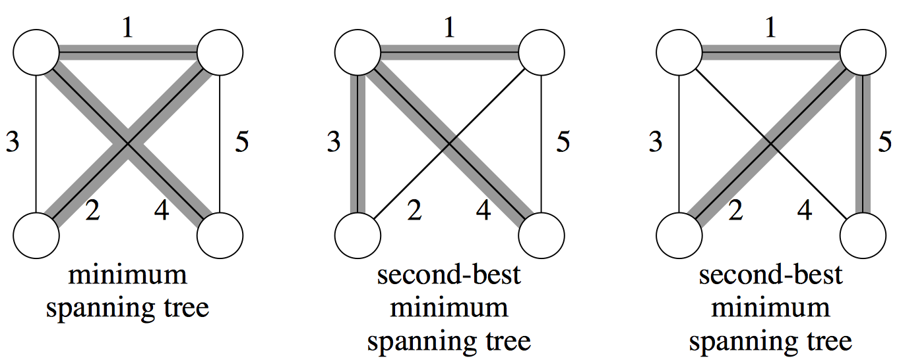

# Algorithmics Homework 10
###### tags: `report` `algorithm`
```
第 7 組
資工二B 109502546 劉語芯
資工二B 109502549 徐瑄琳
資工二B 109502550 許筱敏
資工二B 109502551 葉容瑄
資工二B 109502564 林奕辰
資管二A 109403020 王廷傑
```

### Problem 1

Given a graph G and a minimum spanning tree T, suppose that we decrease the weight of one of the edges not in T. Give an algorithm for finding the minimum spanning tree in the modified graph.


- 高階虛擬碼
```python=
NewMinimumSpanningTree(T, e):
    add e to T
    E <- all edges on the cycle formed by e
    remove the maximum weighted edge in E from T
    return T
```

- 低階虛擬碼
```python=
DFS(currentNode, lastNode, targetNode, MST, E):
    #return whether searched node is in cycle, (MST and E passed by reference)
    if currentNode==targetNode: return true
    inCycle=false
    for edge in MST[currentNode]:
        if edge.n!=lastNode:
            if DFS(edge.n, currentNode, targetNode, MST, E):
                E.push({edge.a, edge.b, edge.w})
                inCycle=true
    return inCycle

NewMinimumSpanningTree(MST, e):
    #MST stored by adjList with attribute n(node), w(weight)
    #e has attribute a(first node), b(second node), w(weight)
    MST[e.a].push({e.b, e.w})
    MST[e.b].push({e.a, e.w})
    initialize edge list E as empty
    DFS(e.a, -1, e.b, MST, E)
    removedEdge=maxWeight(E)#run through E and pick the haviest edge
    MST[removedEdge.a].remove(n=removedEdge.b)
    MST[removedEdge.b].remove(n=removedEdge.a)
    return MST
```

- Time complexity:
finding the cycle takes the time for DFS of the tree so it's $O(|V|+|E|)=O(|V|)$ since $T$ is a tree before e is added, searching through cycle takes at most $O(|E|)=O(|V|)$ also, so the time complexity is $O(|V|)$.

### Problem 2

Suppose that all edge weights in a graph are integers in the range from 1 to |V|. How fast can you make Kruskal’s algorithm run? What if the edge weights are integers in the range from 1 to W for some constant W?

Kruskal's Algorithm :
Time complexity = $O(E \lg E)$
```
A = ∅ ; initial(n) ;                                    //O(V)
for( each edge xy in order by nondecreasing weight)     //O(ElgE)
    if(!find(x,y)){
        union(x,y);                                     //O(Eα(V))
        add xy to A;
        if(|A| == n-1) break;
    }
```
#### idea
-    If the edge weight in the graph int the range from 1 to $|V|$
    Use another way to sort : counting sort
Using counting sort and take $O(E)$ time to sorting ,when the graph is connected.
The total time can be improved to $O(Eα(V))$
-    If the edge weight in the graph int the range from 1 to a constant W
use $O(W+E) = O(E)$ to sort ,since W is a constant can ignore, so yield the  Time complexity $O(Eα(V))$
<!--乾抱歉 我複製的時候不小心改到-->
### Problem 3

Suppose that all edge weights in a graph are integers in the range from 1 to |V|. How fast can you make Prim's algorithm run? What if the edge weights are integers in the range from 1 to W for some constant W?

```python=
while(Q != ∅)
    u = Extract-Min(Q);
    for(each v in Adj(u))
        if(v in Q && w(u,v) < key[v])
            π[v] = u
            key[v] = w(u,v)
            Change-Priority(Q, v, key[v])
```
hint: use different data structure to slow down extract-min and change-priority
- range from 1 to |V| --- use Van Emde Boas tree
     the Van Emde Boas tree can speed up Extract-Min and Change-Priority to $O(\lg \lg V)$. (There exists a way to modify Van Emde Boas tree to satisfy duplicate weight).
     Time complexity:  $O(V \lg \lg V +E \lg \lg V)$.
- range from 1 to W ---  use doubly linked lists(unsure)
    We can implement the queue as an array [1...W+1] where the ith slot holds a doubly linked list of the edges with weight i. The (W+1)st slot contains ∞. EXTRACT-MIN now runs in O(W) = O(1) time.Since we can simply scan for the first nonempty slot and return the first element of that list. Change-Priority runs in O(1) time as well since it can be implemented by moving an element from one slot to another. 
    Time complexity: $O(V+E)$.


<!--從這裡看到的：https://github.com/gzc/CLRS/blob/master/C23-Minimum-Spanning-Trees/23.2.md
https://walkccc.me/CLRS/Chap23/23.2/
那個樹的各種中文介紹:
https://www.cnblogs.com/justinh/p/7427706.html
https://www.twblogs.net/a/5b8aa72e2b71775d1ce84f1a
DECREASE-KEY被我刪掉ㄌ
DecreaseKey : After extracting vertex we need to update keys of its adjacent vertices, and if new key is smaller, then update that in data structure.
原本的句子是說Extract和Decrease key都會減少到一樣。Decreasekey沒在上課的PPT出現縮已就刪了
支援一下上課PPT 但感覺會出現這題應該就是要用那個樹樹(想要我們自學？

再支援一下課本內容
>
-->


### Problem 4

**課本 Problem 23-1 Second-best minimum spanning tree**
Let $G =(V, E)$ be an undirected, connected graph whose weight function is $w: E \rightarrow \Bbb R$, and suppose that $|E| \geq |V|$ and ==all edge weights are distinct==.
We define a second-best minimum spanning tree as follows. Let $\mathcal T$ be the set of all spanning trees of $G$, and let $T'$ be a minimum spanning tree of $G$. Then a **second-best minimum spanning tree** is a spanning tree $T$ such that $w(T) = \min_{T''\in\mathcal T - \{T'\}}\{w(T'')\}$.
a. Show that the minimum spanning tree is unique, but that the second-best minimum spanning tree need not be unique.
b. Let $T$ be the minimum spanning tree of $G$. Prove that $G$ contains edges $(u,v)\in T$ and $(x,y) \notin T$ such that $T - \{(u,v)\} \cup \{ (x,y)\}$ is a second-best minimum spanning tree of $G$.
c. Let $T$ be a spanning tree of $G$ and, for any two vertices $u,v\in V$, let $\max[u,v]$ denote an edge of maximum weight on the unique simple path between $u$ and $v$ in $T$. Describe an $O(V^2)$-time algorithm that, given $T$ , computes $\max[u,v]$ forall $u,v \in V$ .
d. Give an efficient algorithm to compute the second-best minimum spanning tree of $G$.

<!--  -->
#### a. 證明MST是唯一的，但SBMST不唯一
( 前提: 整張圖不存在權重相同的兩個邊 )
##### 1) all edge weights are distinct $\Rightarrow$ MST is unique
For a cut seperate $V$ into $X, Y$
$E_{X}$ denotes $\{(u,v) | u, v\in X\}$
$E_{Y}$ denotes $\{(u,v) | u, v \in Y\}$
$E_{XY}$ denotes $\{(u,v) | u\in X, v \in Y\}$
$T_X$ denotes MST of $\{X, E_X\}$
$T_Y$ denotes MST of $\{Y, E_Y\}$

Let $T$ be the MST of $G$, $(x,y)$ be the light edge for the cut.
$\Rightarrow w(T) = w(T_X) + w(T_Y) + w(\{(x,y)\})$

If there exists an edge $(x', y') \in E_{XY}$ such that $w(T') = w(T_X) + w(T_Y) + w(\{(x',y')\}) < w(T_X) + w(T_Y) + w(\{(x,y)\})$
$\Rightarrow T$ is not a MST of $G$

##### 2) all edge weights are distinct $\Rightarrow$ SBMST is not unique


#### b. 證明SBMST必定是一棵從MST移除一邊並加入原本不在MST的一邊的樹
Let $T_2$ be a second-best minimum spanning tree of $G$.
Let $(u, v) \in T - T_2$. $\implies$ $(u, v)$ is an edge that in $T$ but not in $T_2$.

$T_2$ $\cup$ $(u,v)$ must contain a cycle $C$, where an edge $(x,y) \notin T$. (By ***cycle property***)

Then, we must have $w(x, y) > w(u, v)$. (Otherwise, we could replace $(x, y)$ by $(u, v)$ in $T_2$ to get a MST better than $T_2$.)

Note that $S = T_2 - \{(x,y)\} \cup \{(u,v)\}$ is also a spanning tree, because $(u,v)$ and $(x,y)$ are in the same cycle $C$.

In addition, $w(S) < w(T_2)$ $\implies$ $S$ is a best MST.
By uniqueness of MST mentioned in (a), $S = T$, therefore $T$ and $T_2$ differs by only one edge.

> **Theorem**. (*Cycle Property*): If $(x, y)$ is an edge in $G$ and is the **heaviest edge** on some cycle $C$, then $(x, y)$ does not belong to any MST of $G$.
> 
> 白話文：如果有環，最重的那條邊一定不在 MST 裡面

#### c. 在$O(|V|^2)$內算出所有$Max[u,v]$的值 ($Max[u,v]$表在一生成樹上，$u$ 到 $v$ 路上最大的weight的邊)
> 我偷偷改了一下 notation
- 遞迴式
$Max[u,y] = \begin{cases}
Max[u,x],\ w(Max[u,x]) > w[x,y]\\
(x,y),\ otherwise
\end{cases}$
- pseudo code
```
MaxWeight(G)
    Max[1...|V|][1...|V|] = -∞
    for i = 1 to |V|: Max[i][i] = 0 // init
    for u in V: DFS(u,u)
    return Max
DFS(u, x)
    for y in Adj[u]:
        Max[u][y] = max(Max[u][x], w(x,y))
        DFS(u, y)
```
- analysis
對 Spannig tree 進行 DFS 共 $|V|$ 次，每次走過所有共 $|V|-1$ 個邊 $\Rightarrow O(|V|^2)$

#### d. design algorithm of SBMST
- pseudo code
```
SBMST()
    1. Find MST by Kruscal's Algorithm
    2. Run MaxWeight()
    3. Find an edge (x, y) ∈ E − T that minimizes w(x, y) − w(max[x, y]).
    return T2 = (T − max[x, y]) ∪ (x, y).
```
Time Complexity 
1. $O(E \lg E)$
2. $O(V^2)$
3. $O(E)$
Total: $O(V^2+E\lg E)$

參考資料[1](https://sites.google.com/view/ntpuprog/%E8%AA%B2%E7%A8%8B%E8%B3%87%E6%BA%90%E8%88%87%E7%B7%B4%E7%BF%92%E6%B8%85%E5%96%AE/2019/%E6%9C%80%E5%B0%8F%E7%94%9F%E6%88%90%E6%A8%B9/%E6%AC%A1%E5%B0%8F%E7%94%9F%E6%88%90%E6%A8%B9)、[2](https://www.csie.ntu.edu.tw/~r95122/alg07spr/alg07spr_hw2sol.pdf)

### Problem 5

課本 Problem 16-4 Scheduling Variations

Consider the following algorithm for the problem from Section 16.5 of scheduling unit-time tasks with deadlines and penalties. Let all $n$ time slots be initially empty, where time slot $i$ is the unit-length slot of time that finishes at time $i$. We consider the tasks in order of monotonically decreasing penalty. When considering task $a_j$, if there exists a time slot at or before $a_j$ ’s deadline $d_j$ that is still empty, assign $a_j$ to the latest such slot, filling it. If there is no such slot, assign task $a_j$ to the latest of the as yet unfilled slots.


- 題目翻譯
    - task $a_i, ..., a_n$
    - 每個 task 花費時間相同，總時間為 $n$
    - 每個 task 未在 deadline 前完成會有各自的 penalty，task 已經依照 penalty 大到小排序
- 演算法：
    - 共有 $n$ 個 slot，可以想像成大小為 $n$ 的 array
    - 插入新的 task 時，若是他的 deadline 之前仍有空位則可插入，若 deadline 前無空位則插入最後的空位
---
- **Argue that this algorithm always gives an optimal answer.**

Let $O$ be an optimal solution. 

If $a_j$ is scheduled before its deadline, we can always swap it with whichever activity is scheduled at its deadline without changing the penalty. 

If it is scheduled after its deadline but $a_j.deadline > j$, then there must exist a task from among the first $j$ with penalty less than that of $a_j$ . We can then swap $a_j$ with this task to reduce the overall penalty incurred. Since $O$ is optimal, this can't happen. 

Finally, if $a_j$ is scheduled after its deadline and $a_j.deadline \le j$, we can swap $a_j$ with any other late task without increasing the penalty incurred. 

- **Use the fast disjoint-set forest presented in Section 21.3 to implement the algorithm efficiently. Assume that the set of input tasks has already been sorted int monotonically decreasing order by penalty. Analyze the running time of your implementation.**
```
SCHEDULING-VARIATIONS(A)
    D[1..n] <- new array
    stack <- store illegal value
    for i = 1 to n
        a[i].time = a[i].deadline
        if D[a[i].deadline] != NIL:
            y = FIND-SET(D[a[i].deadline])
            a[i].time = y.low - 1
        x = MAKE-SET(a[i])
        if a[i].time < 1:
            stack.push(x)
            continue
        D[a[i].time] = x
        x.low = x.high = a[i].time
        if D[a[i].time - 1] != NIL:
            UNION(D[a[i].time - 1], D[a[i].time])
        if D[a[i].time + 1] != NIL:
            UNION(D[a[i].time], D[a[i].time + 1])
    for i = n to 1
        if stack.empty(): break
        if D[i] = NIL
            p = stack.pop()
            D[i] = p
```
time complexity: $O(nα(n))$
<!-- https://walkccc.me/CLRS/Chap16/Problems/16-4/ -->
### Problem 6

For a set of variables $x_1, x_2, \dots , x_n$, you are given some equality constraints, of the form “$x_i = x_j$” and some disequality constraints, of the form “$x_i \ne x_j$”. Is it possible to satisfy all of them? For instance, the constraints : 
$x_1 = x_2\ ;\ x_2 = x_3\;\ x_3 = x_4\ ;\ x_1 \ne x_4$;
cannot be satisfied. Give an efficient algorithm that takes as input $m$ constraints over $n$ variables and decides whether the constraints can be satisfied. Describe the data structure used by your algorithm, and analysis the time complexity of your algorithm.

<!--好難...

> 用 dsu，先看過所有的等式整理好表格後，檢查每個不等式是否成立
-->
- Idea
    1. Each variable is a disjoint set
    2. "union" each two equal variables
    3. check whether each two variable in disequlity constraints in the same set
- Pseudo code
~~~
check():
    //using <first, second> to represent the two variables in constraints
    eq[] <- the set of equlity constraints 
    neq[] <- the set of disequlity constraints
    for i=0 to n-1: create(i)
    for i=0 to eq.size():
        union(eq[i].first, eq[i].second)
    for i=0 to neq.size():
        if(find(neq[i].first)==find(neq[i].second)) return false
    return true
~~~
- Analysis
    - Time complexity: $O(m\ \alpha (n))$

<!-- 
union(1,2)
union(3,4)
union(1,4)
 -->