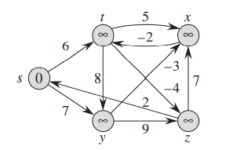
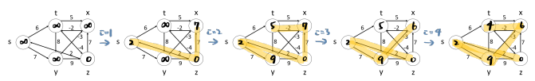
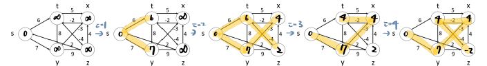
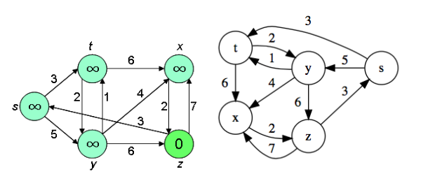
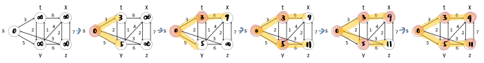
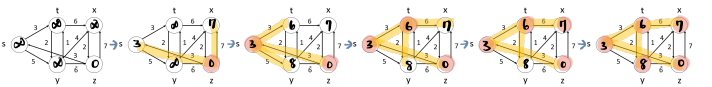
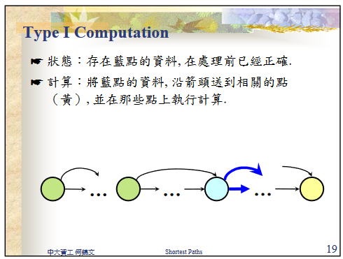
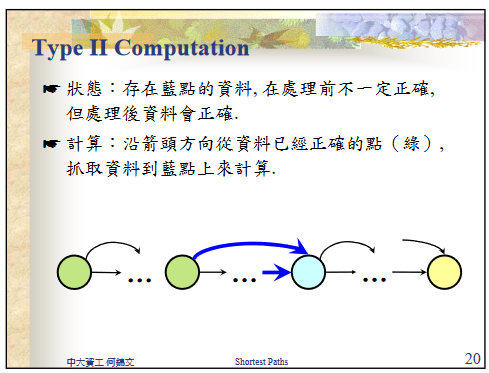
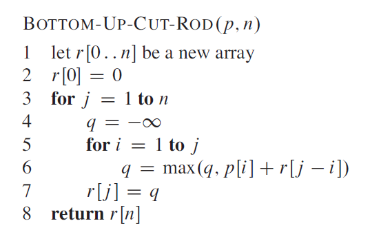
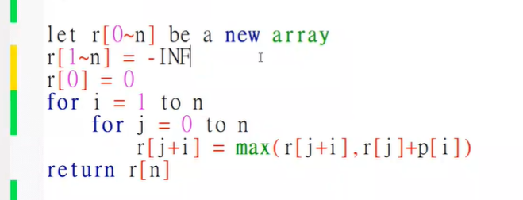

# Algorithmics Homework 11
###### tags: `report` `algorithm`
```
第 7 組
資工二B 109502546 劉語芯
資工二B 109502549 徐瑄琳
資工二B 109502550 許筱敏
資工二B 109502551 葉容瑄
資工二B 109502564 林奕辰
資管二A 109403020 王廷傑
```

### Problem 1

Run the Bellman-Ford algorithm on the directed graph of Figure 24.4, using vertex $z$ as the source. In each pass, relax edges in the same order as in the figure, and show the d and $\pi$ values after each pass. Now, change the weight of edge $(z, x)$ to 4 and run the algorithm again, using $s$ as the source.


#### using vertex $z$ as the source



- d value
    
|  | s | t | x | y | z |
| -------- | -------- | -------- | -------- | -------- | -------- |
| i=0 | $\infty$ | $\infty$ | $\infty$ | $\infty$ | 0 |
| i=1 | 2 | $\infty$ | 7 | $\infty$ | 0 |
| i=2 | 2 | 5 | 7 | 9 | 0 |
| i=3 | 2 | 5 | 6 | 9 | 0 |
| i=4 | 2 | 4 | 6 | 9 | 0 |

- $\pi$ value

| | s | t | x | y | z |
| -------- | -------- | -------- | -------- | -------- | -------- |
| i=0 | NIL | NIL | NIL | NIL | NIL |
| i=1 | z | NIL | z | NIL | NIL |
| i=2 | z | x | z | s | NIL |
| i=3 | z | x | y | s | NIL |
| i=4 | z | x | y | s | NIL |

#### change the weight of edge $(z, x)$ to 4, and using $s$ as the source


- d value
    
|  | s | t | x | y | z |
| -------- | -------- | -------- | -------- | -------- | -------- |
| i=0 | 0 | $\infty$ | $\infty$ | $\infty$ | $\infty$ |
| i=1 | 0 | 6 | $\infty$ | 7 | $\infty$ |
| i=2 | 0 | 6 | 4 | 7 | 2 |
| i=3 | 0 | 2 | 4 | 7 | 2 |
| i=4 | 0 | 2 | 4 | 7 | -2 |

- $\pi$ value

| | s | t | x | y | z |
| -------- | -------- | -------- | -------- | -------- | -------- |
| i=0 | NIL | NIL | NIL | NIL | NIL |
| i=1 | NIL | s | NIL | s | NIL |
| i=2 | NIL | s | y | s | t |
| i=3 | NIL | x | y | s | t |
| i=4 | NIL | x | y | s | t |

- $\because d[x] > d[z]+edge(z,x)$
    $\therefore$ it will return false which means this graph has negative cycle
<!--
- 參考

[參考2](https://walkccc.me/CLRS/Chap24/24.1/)
-->
### Problem 2
Let $G = (V, E)$ be a weighted, directed graph with weight function w : E → R. Give an $O(VE)$-time algorithm to find, for each vertex v ∈ V , the value $δ^*(v) = \min_{u∈V}\{δ(u, v)\}$

modify relaxation in Bellman-Ford algorithm and initial case $\forall v, d[v]=0$

```python=
ModifiedRelaxation(u, v, w):
    if d[u] + w(u, v) < d[v]:
        d[v] = d[u] + w(u, v)
        π[v] = π[u]
        
ModifiedBellmanFord(G):
    for all v in G: π[v]=v,d[v]=0
    for i from 1 to |G.V| - 1:
        for each edge uv in G.E:
            ModifiedRelaxation(u, v, w)
    for each edge uv in G.E:
        if d[u] + w(u, v) < d[v]:
            return false
    return true
```


### Problem 3

Suppose that a weighted, directed graph G = (V, E) has a negative-weight cycle. Give an efficient algorithm to list the vertices of one such cycle. Prove that your algorithm is correct.

Add another array c[v] ,$∀ v ∈ V$ and later hold 1 if this node is part of a negative-cycle
and 0 otherwise. 
Time complexity : $O(VE)$
```
ModifiedBellmanFord(G,s):
    Let Perhabs_cycle=[] to store the vertice that may be a clcye //index start from 1
    Let neg_cycle=[] to store a negative cycle //index start from 1
    Initiallize(G,s) // π[v] <- Nil , d[v] <- ∞ c[v] <- 0,∀ v; d[s] <- 0
    for i = 1 to |V| - 1
        for each edge (u, v) ∈ E do
            RELAX(u, v)
    for each edge (u, v) ∈ E do
        if d[v] > d[u] + w(u,v)
           c[v] = 1
           curr = v
           while c[π[curr]] == 0:
               curr = π[curr]
               c[curr] = 1
               Perhabs_cycle.append(curr)
           neg_cycle.append(π[cur])
           for i = length of Perhabs_cycle  to 1
               if π[cur] != Perhabs_cycle[i]
                   neg_cycle.append(Perhabs_cycle[i])
               else break
            return neg_cycle
```


### Problem 4

Run Dijkstra's algorithm on the directed graph of Figure 24.2, first using vertex s as the source and then using vertex z as the source. In the style of Figure 24.6, show the d and π values and the vertices in set S after each iteration of the while loop.


#### using vertex $s$ as the source


- d value
    
| s | t | x | y | z |
| -------- | -------- | -------- | -------- | -------- |
| 0 | $\infty$ | $\infty$ | $\infty$ | $\infty$ |
| 0 | 3 | $\infty$ | 5 | $\infty$ |
| 0 | 3 | 9 | 5 | $\infty$ |
| 0 | 3 | 9 | 5 | 11 |
| 0 | 3 | 9 | 5 | 11 |
| 0 | 3 | 9 | 5 | 11 |

- $\pi$ value

| s | t | x | y | z |
| -------- | -------- | -------- | -------- | -------- |
| NIL | NIL | NIL | NIL | NIL |
| NIL | s | NIL | s | NIL |
| NIL | s | t | s | NIL |
| NIL | s | t | s | y |
| NIL | s | t | s | y |
| NIL | s | t | s | y |

#### using vertex $z$ as the source


- d value
    
| s | t | x | y | z |
| -------- | -------- | -------- | -------- | -------- |
| $\infty$ | $\infty$ | $\infty$ | $\infty$ | 0 |
| 3 | $\infty$ | 7 | $\infty$ | 0 |
| 3 | 6 | 7 | 8 | 0 |
| 3 | 6 | 7 | 8 | 0 |
| 3 | 6 | 7 | 8 | 0 |
| 3 | 6 | 7 | 8 | 0 |

- $\pi$ value

| s | t | x | y | z |
| -------- | -------- | -------- | -------- | -------- |
| NIL | NIL | NIL | NIL | NIL |
| z | NIL | z | NIL | NIL |
| z | s | z | s | NIL |
| z | s | z | s | NIL |
| z | s | z | s | NIL |
| z | s | z | s | NIL |
<!--
- 參考

> 為甚麼助教還沒發布星期四的影片QAQ [time=Sat, May 14, 2022 11:49 AM]
> 應該不用畫圖吧
> 
> 
-->


### Problem 5

Professor Gaedel has written a program that he claims implements Dijkstra’s algorithm. The program produces v.d and v.π for each vertex v ∈ V. Give an O(V + E)- time algorithm to check the output of the professor’s program. It should determine whether the d and π attributes match those of some shortest-paths tree. You may assume that all edge weights are nonnegative.

- run DFS
- should satisfy
    - d[s] = 0 and π[s] = NIL (s means source)
    -  d[v] =  d[ π[v] ] + w( π[v] , v) for all v ≠ s
    -  d[v] = ∞ if and only if π[v] = NIL for all v ≠ s
- if the above three points are not satisfied, then false.
- time complexity: $O(DFS)=O(V+E)$

### Problem 6

Let $G = (V,E)$ be a weighted, directed graph with nonnegative weight function $w : E→\{ 0 , 1 ,\dots,W\}$ for some nonnegative integer $W$. Modify Dijkstra’s algorithm to compute the shortest paths from a given source vertex *s* in $O(WV + E)$ time.

```cpp
Modified_Dijkstra(G: graph, s: source):
    Initialize(G, s) // p[v] = -1, d[v] = INF, for all v; d[s] = 0
        
    // build a priority queue Q for V with d[v] as key
    bucket[0...((v-1)*w+1)]
    for v in V:
        bucket[(v-1)*w+1].append(v)
    bucket[0] = s
    
    // modified Disjkstra
    for scanner = 0 to (v-1)*w+1:
        if bucket[scanner].empty() :
            scanner++
            continue
        for u in bucket[scanner]:
            for v in G[u]:
                if v is in Q and d[v] > d[u] + w(u, v):
                    bucket[d[v]].delete(v)
                    d[v] = d[u] + w(u, v)
                    p[v] = u
                    bucket[d[v]].append(v)
```
- 決定複雜度的操作
    - $|V|$次 `Extract-Min`
    - $|E|$次 `Change-Priority`

- 使用 hash table 作為 priority queue, key = `d[v]`, value = `v`
    >note: $0\le$  d[v] $\le$ (|V|-1)W
    - `Extract-Min` $\rightarrow(|V|-1)W$
        - 從第0個籃子開始找，如果籃子是空的就找下一個；若籃子非空，對籃子裡的每個`u`，對`v ∈ adj[u]` 進行 relax
        - 每次 `Extract-Min` 都從上次停下的位置再繼續找下一個，直到整排籃子都被看過一次
    - `Change-Priority` $\rightarrow |E|\times 1$
        1. 在第`d[v]`個籃子找到`v`
        2. 把`v`拿起來
        3. 丟進第`d[u]+w(u,v)`個籃子
- get time complexity $O(WV+E)$


### Problem 7

課本 p.366 提到 ROD-CUT 問題，其中 BOTTOM-UP-CUT-ROD()的 pseudo code 是屬於 unit09_ppt 中 p.19、p.20 中的哪一項(Type I or Type II)?並且請將 BOTTOM-UP-CUT-ROD()的 pseudo code 改寫為另一種 Type。








- 類型
    - 屬於 Type II
    - bottom-up 的做法是由左到右逐一計算各個 element 的值，計算時需要以前面已經計算好的值來作為基礎進行計算
- Type I 做法的 Pseudo Code
    ```= C++
    Bottom-up-cut-rod(p, n):
        for j = 0 to n-1
            q = -infinity
            for i = 0 to j
                q = max(q, r[i]+p[j+1-i])
            r[j+1] = q
        retrun r[n]
    ```

- 助教給ㄉcode



> 改成 j=0 to n-i