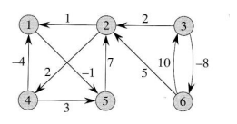
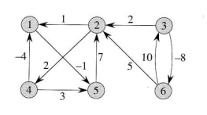
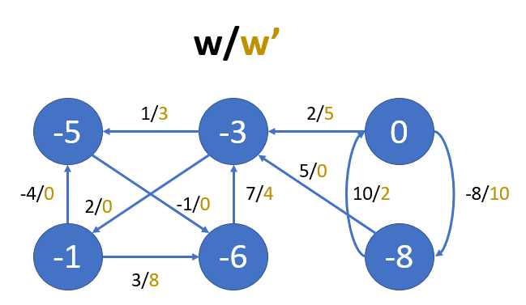

# Algorithmics Homework 12
###### tags: `report` `algorithm`
```
第 7 組
資工二B 109502546 劉語芯
資工二B 109502549 徐瑄琳
資工二B 109502550 許筱敏
資工二B 109502551 葉容瑄
資工二B 109502564 林奕辰
資管二A 109403020 王廷傑
```

### Problem 1

Consider that we set $d(u, u) = \infty$ initially while running Floyd-Warshall algorithm, what does it mean if we finally find some $u$ such that $d(u, u) < \infty$.

**Answer**
If $d(u,u) < \infty$, it means that there is a cycle including $u$ with the shortest path.
Besides, if $d(u, u)<0$, it means that there is a negative cycle.

**Explanation**
In the begining we set $d(u,u)=\infty$, consequently, if there are a cycle including $u$, the weight of the path is less than $\infty$, and the value of $d(u,u)$ will be replaced.


### Problem 2 

Find a feasible solution or determine that no feasible solution exists for the following system of difference constraints:
$x_1 - x_2 \le 4$ ,
$x_1 - x_5 \le 5$ ,
$x_2 - x_4 \le -6$ ,
$x_3 - x_2 \le 1$ ,
$x_4 - x_1 \le 3$ ,
$x_4 - x_3 \le 5$ ,
$x_4 - x_5 \le 10$ ,
$x_5 - x_3 \le -4$ ,
$x_5 - x_4 \le -8$ .


$\because\left\{\begin{array}{ll}
x_4 - x_1 \le 3\\
x_2 - x_4 \le -6\\
x_3 - x_2 \le 1\\
x_5 - x_3 \le -4\\
x_1 - x_5 \le 5
\end{array}\right.\Rightarrow 3+(-6)+1+(-4)+5 = -1\\
\therefore \text{There is a negative-weight cycle} \Rightarrow \text{no feasible solution}$

### Problem 3(鐵蛋)

Give an efficient algorithm to find the length (number of edges) of a minimum-length negative-weight cycle in a graph.


```python=
minimumLengthOfNegativeCycle(G):
    #vertex index start from 1 to |G.V|
    for all 1<=u, v<=|G.V| in d, l:
        if u==v: d[u][v] = 0
        else: d[u][v]=inf
    for uv in G.E:
        d[u][v]=w(u, v)
    for i from 1 to |G.V|:
        for j from 1 to |G.V|:
            for k from 1 to |G.V|:
                for l from 1 to |G.V|:
                    d[j][k]=min(d[j][k], d[j][l]+d[l][k])
                    if j==k and d[j][k]<0:
                        return i
    return inf#no negetive cycle for G
                    
```
Time complexity: $O(V^4)$ or $O(V^3p)$ while p=returned value (input dependent)


### Problem 4(Kenny)
<!--阿你這效率是三小-->

Run the Floyd-Warshall algorithm on the weighted, directed graph of Figure 25.2. and answer the following questions:
a. Show the matrix D(k) that results for each iteration of the outer loop.
b. List the vertices of one such shortest path from v6 to v1.


#### a. 
- k = 0
    - D
    \begin{pmatrix}
      0 &  ∞ & ∞ & ∞  & -1 & ∞\\
      1 & 0  & ∞ & 2 & ∞& ∞\\
       ∞ & 2  & 0 & ∞ & ∞ & -8\\
      -4 & ∞ & ∞ & 0& 3& ∞\\
       ∞& 7& ∞& ∞& 0& ∞\\
        ∞& 5& 10& ∞& ∞& 0
    \end{pmatrix}
    - P
    \begin{pmatrix}
      0 &  0 & 0 & 0  & 0 & 0\\
      0 &  0 & 0 & 0  & 0 & 0\\
      0 &  0 & 0 & 0  & 0 & 0\\
      0 &  0 & 0 & 0  & 0 & 0\\
      0 &  0 & 0 & 0  & 0& 0\\
      0 &  0 & 0 & 0  & 0& 0\\
    \end{pmatrix}
- k = 1
    - D
    \begin{pmatrix}
      0 &  ∞ & ∞ & ∞  & -1 & ∞\\
      1 & 0  & ∞ & 2 & 0& ∞\\
       ∞ & 2  & 0 & ∞ & ∞ & -8\\
      -4 & ∞ & ∞ & 0& -5& ∞\\
       ∞& 7& ∞& ∞& 0& ∞\\
        ∞& 5& 10& ∞& ∞& 0
    \end{pmatrix}
    - P
    \begin{pmatrix}
      0 &  0 & 0 & 0  & 0 & 0\\
      0 &  0 & 0 & 0  & 1 & 0\\
      0 &  0 & 0 & 0  & 0 & 0\\
      0 &  0 & 0 & 0  & 1 & 0\\
      0 &  0 & 0 & 0  & 0& 0\\
      0 &  0 & 0 & 0  & 0& 0\\
    \end{pmatrix}
- k = 2
    - D
    \begin{pmatrix}
      0  & ∞  & ∞  & ∞  & -1 & ∞  \\
      1  & 0  & ∞  & 2  & 0  & ∞  \\
      3  & 2  & 0  & 4  & 2  & -8 \\
      -4 & ∞  & ∞  & 0  & -5 & ∞  \\
      8  & 7  & ∞  & 9  & 0  & ∞  \\
      6  & 5  & 10 & 7  & 5  & 0  \\
    \end{pmatrix}
    - P
    \begin{pmatrix}
      0 &  0 & 0 & 0  & 0 & 0\\
      0 &  0 & 0 & 0  & 1 & 0\\
      2 &  0 & 0 & 2  & 2 & 0\\
      0 &  0 & 0 & 0  & 1 & 0\\
      2 &  0 & 0 & 2  & 0& 0\\
      2 &  0 & 0 & 2  & 2& 0\\
    \end{pmatrix}
- k = 3
    - D
    \begin{pmatrix}
      0  & ∞  & ∞  & ∞  & -1 & ∞  \\
      1  & 0  & ∞  & 2  & 0  & ∞  \\
      3  & 2  & 0  & 4  & 2  & -8 \\
      -4 & ∞  & ∞  & 0  & -5 & ∞  \\
      8  & 7  & ∞  & 9  & 0  & ∞  \\
      6  & 5  & 10 & 7  & 5  & 0  \\
    \end{pmatrix}
    - P
    \begin{pmatrix}
      0 &  0 & 0 & 0  & 0 & 0\\
      0 &  0 & 0 & 0  & 1 & 0\\
      2 &  0 & 0 & 2  & 2 & 0\\
      0 &  0 & 0 & 0  & 1 & 0\\
      2 &  0 & 0 & 2  & 0& 0\\
      2 &  0 & 0 & 2  & 2& 0\\
    \end{pmatrix}
- k = 4
    - D
    \begin{pmatrix}
      0  & ∞  & ∞  & ∞  & -1 & ∞  \\
      -2 & 0  & ∞  & 2  & -3  & ∞  \\
      0  & 2  & 0  & 4  & -1  & -8 \\
      -4 & ∞  & ∞  & 0  & -5 & ∞  \\
      5  & 7  & ∞  & 9  & 0  & ∞  \\
      3  & 5  & 10 & 7  & 2  & 0  \\
    \end{pmatrix}
    - P
    \begin{pmatrix}
      0 &  0 & 0 & 0  & 0 & 0\\
      4 &  0 & 0 & 0  & 4 & 0\\
      4 &  0 & 0 & 2  & 4 & 0\\
      0 &  0 & 0 & 0  & 1 & 0\\
      4&  0 & 0 & 2  & 0& 0\\
      4 &  0 & 0 & 2  & 4& 0\\
    \end{pmatrix}
- k = 5
    - D
    \begin{pmatrix}
      0  & 6  & ∞  & 8  & -1 & ∞  \\
      -2 & 0  & ∞  & 2  & -3  & ∞  \\
      0  & 2  & 0  & 4  & -1  & -8 \\
      -4 & 2  & ∞  & 0  & -5 & ∞  \\
      5  & 7  & ∞  & 9  & 0  & ∞  \\
      3  & 5  & 10 & 7  & 2  & 0  \\
    \end{pmatrix}
    - P
    \begin{pmatrix}
      0 &  5 & 0 & 5  & 0 & 0\\
      4 &  0 & 0 & 0  & 4 & 0\\
      4 &  0 & 0 & 2  & 4 & 0\\
      0 &  5 & 0 & 0  & 1 & 0\\
      4&  0 & 0 & 2  & 0& 0\\
      4 &  0 & 0 & 2  & 4& 0\\
    \end{pmatrix}
- k = 6
    - D
    \begin{pmatrix}
      0  & 6  & ∞  & 8  & -1 & ∞  \\
      -2 & 0  & ∞  & 2  & -3  & ∞  \\
      -5 & -3 & 0  & -1 & -6  & -8 \\
      -4 & 2  & ∞  & 0  & -5 & ∞  \\
      5  & 7  & ∞  & 9  & 0  & ∞  \\
      3  & 5  & 10 & 7  & 2  & 0  \\
    \end{pmatrix}
    - P
    \begin{pmatrix}
      0 &  5 & 0 & 5  & 0 & 0\\
      4 &  0 & 0 & 0  & 4 & 0\\
      6 &  6 & 0 & 6  & 6 & 0\\
      0 &  5 & 0 & 0  & 1 & 0\\
      4 &  0 & 0 & 2  & 0& 0\\
      4 &  0 & 0 & 2  & 4& 0\\
    \end{pmatrix}
#### b.
查P表 shortest path from $v_6$ to $v_1$ is $v_6 \rightarrow v_2 \rightarrow v_4 \rightarrow v_1$


### Problem 5（金魚）

Use Johnson's algorithm to find the shortest paths between all pairs of vertices in the graph of Figure 25.2. Show the values of h and ŵ computed by the algorithm.


- $h(v)=\delta(s,v)$
- $w'(e)=w(e)+h(u)-h(v)$
- Step 1: Use Bellman-Ford algorithm to calculate $h(v), \forall v \in V$
- Step 2: reweighting



### Problem 6 (大俠)

**Arbitrage** is the use of discrepancies in currency exchange rates to transform one unit of a currency into more than one unit of the same currency. For example, suppose that 1 U.S. dollar buys 49 Indian rupees, 1 Indian rupee buys 2 Japanese yen, and 1 Japanese yen buys 0.0107 U.S. dollars. Then, by converting currencies, a trader can start with 1 U.S. dollar and buy 49×2×0.0107 = 1.0486 U.S. dollars, thus turning a profit of 4.86 percent. 
Suppose that we are given $n$ currencies $c_1, c_2,\dots, c_n$ and an $n×n$ table $R$ of exchange rates, such that one unit of currency $c_i$ buys $R[i, j]$ units of currency $c_j$.
a. Give an efficient algorithm to determine whether or not there exists a sequence of currencies $<c_{i1}, c_{i2}, …, c_{ik}>$ such that $R[i_1, i_2]×R[i_2, i_3]×\dots×R[i_{k-1}, i_k ]×R[i_k, i_1 ] > 1$ . Analyze the running time of your algorithm.
b. Give an efficient algorithm to print out such a sequence if one exists. Analyze the running time of your algorithm.

> 套利:
> 1 美元 -> 49 印度盧比 -> 98 日圓 -> 1.0486 美元
> 好欸錢錢變多了

#### 觀察與想法
0. ~~假設題目給定的 $R$ 是全連通圖~~
1. 解最短路徑的演算法，路徑長是把邊的權重相加
2. 這題的$R[i,j]$彼此是相乘的關係，要求是否存在一路徑相乘大於1
3. $R[i_1, i_2]×R[i_2, i_3]×\dots×R[i_{k-1}, i_k ]×R[i_k, i_1 ] > 1\\
    (兩邊同取倒數)\\
    \Rightarrow\dfrac1{R[i_1, i_2]×R[i_2, i_3]×\dots×R[i_{k-1}, i_k ]×R[i_k, i_1 ]} < 1\\
    \Rightarrow \dfrac1{R[i_1, i_2]} × \dfrac1{R[i_2, i_3]} × \dots × \dfrac1{R[i_{k-1}, i_k]} × \dfrac1{R[i_k, i_1]} < 1\\
    (兩邊同取\lg)\\
    \Rightarrow \lg(\dfrac1{R[i_1, i_2]} × \dfrac1{R[i_2, i_3]} × \dots × \dfrac1{R[i_{k-1}, i_k]} × \dfrac1{R[i_k, i_1]}) < \lg 1\\
    \Rightarrow \lg\dfrac1{R[i_1, i_2]} + \lg\dfrac1{R[i_2, i_3]} + \dots + \lg\dfrac1{R[i_{k-1}, i_k]} + \lg\dfrac1{R[i_k, i_1]} < 0$
4. $w(v_i,v_j) = -\lg R[i,j]$
5. 加入 dummy node $v_0$, let $\forall v_i \in V s.t. w(v_0,v_i) = 0$
6. 從$v_0$開始跑 Bellman-Ford 檢測是否有負環存在：
    無負環 -> 沒有套利關係存在
    有負環 -> 有套利關係存在

#### pseudo code
```
Arbitrage_with_Bellman_Ford(G,s):
    // init
    for v=0 to n:
        π[v] <- NIL
        d[v] <- ∞
    d[0]<-0
    
    // convert R-matrix
    for i=1 to n:
        for j=1 to n:
            w(i,j) = -log(R[i,j])
    
    // relax
    for i=1 to n:
        for each (u,v) in E:
            if d[v] > d[u]+w(u,v):
                d[v] <- d[u]+w(u,v)
                π[v] <- u
    
    // detect negative cycle
    c[] // store vertex on negative cycle
    for each (u,v) in E:
        if d[v] > d[u]+w(u,v):
            c.append(u)
    if !c.empty():
        get_neg_cycle(G, π, c)
    return c.empty()

get_neg_cycle(G, π, c):
    queue q // represent negative cycle
    vis[0...n] <- false
    u = c[0]
    while !vis[u]:
        vis[u] = true
        q.push(u)
        u = π[u]
    while q.top()!=u:
        q.pop()
    return q
```

#### time complexity
1. create $G(V, E), |V| = n+1$, with adjacency matrix $\Rightarrow O(n^2)$
2. run Bellman-Ford $\Rightarrow O(VE) = O(n^3)$
3. print the elements on negative cycle $\Rightarrow O(VE) = O(n^3)$

$\Rightarrow$ both **a** & **b** needs $O(n^3)$


### Problem 7(amao)

Suppose that we wish to maintain the transitive closure of a directed graph $G= (V, E)$ as we insert edges into E. That is, after each edge has been inserted, we want to update the transitive closure of the edges inserted so far. Assume that the graph G has no edges initially and that we represent the transitive closure as a Boolean matrix.
a. Show how to update the transitive closure $G* = (V, E*)$ of a graph $G= (V, E)$ in $O(V^2)$ time when a new edge is added to G.
b. Give an example of a graph G and an edge e such that $𝛺(V^2)$ time is required to update the transitive closure after the insertion of e into $G$, no matter what algorithm is used.
c. Describe an efficient algorithm for updating the transitive closure as edges are inserted into the graph. For any sequence of n insertions, your algorithm should run in total time $\sum_{i=1}^{n}t_i=O(V^3)$, where $t_i$ is the time to update the transitive closure upon inserting the ith edge. Prove that your algorithm attains this time bound.

a.
```python=
transitiveUpdate(T,u,v) #means add an edge uv
    for i=1 to |V|
        for j=1 to |V|
            if T[i,u]==1 and T[v,j]==1
                T[i,j]=1
```
b. (給個至少需要$V^2$時間的例子)
在$v_1 \rightarrow v_2 \rightarrow v_3 \rightarrow v_4 \rightarrow ...\rightarrow v_{|v|}$ 插入$(v_{|v|}, v_1)$，也就代表會有 $\Theta(V^2)$個entry需要改動，時間複雜度必定為$\Omega (V^2)$

- 插入前，上三角形皆為1，有$V*(V-1)/2$個點為0
\begin{pmatrix} 
      1 &  1 & 1 & 1  & ... & 1\\
      0 & 1  & 1 & 1 & ...& 1\\
       0 & 0  & 1 & 1 & ... & 1\\
      0 & 0 & 0 & 1&... & 1\\
       0& 0& 0& 0& ...& 1\\
        0& 0& 0& 0& ...& 1
    \end{pmatrix}


c. n個插入，時間在$V^3$內
```python=
transitiveUpdate(T,u,v) #means add an edge uv
    for i=1 to |V|
        if T[i,u]==1 and T[i,v]==0
            for j=1 to |V|
                if T[v,j]==1
                    T[i,j]=1
```
$n \le |V|^2$，因為在di-graph裡邊的個數不超過$|V|^2$
只執行外迴圈：$O(nV)=O(V^3)$
$i \rightarrow u \rightarrow v \rightarrow j$ ，第三行的if 能讓最後三行的for迴圈在外迴圈的$V^3$次裡執行小於$|V|^2$次，因為只要跑一次最後三行的for迴圈，T[i,v]為零的個數必至少減一。
time complexity: 只跑外迴圈+有進內迴圈 =$O(nV-V^2)+(V^2*V)=O(V^3)$


