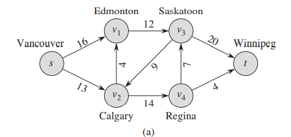
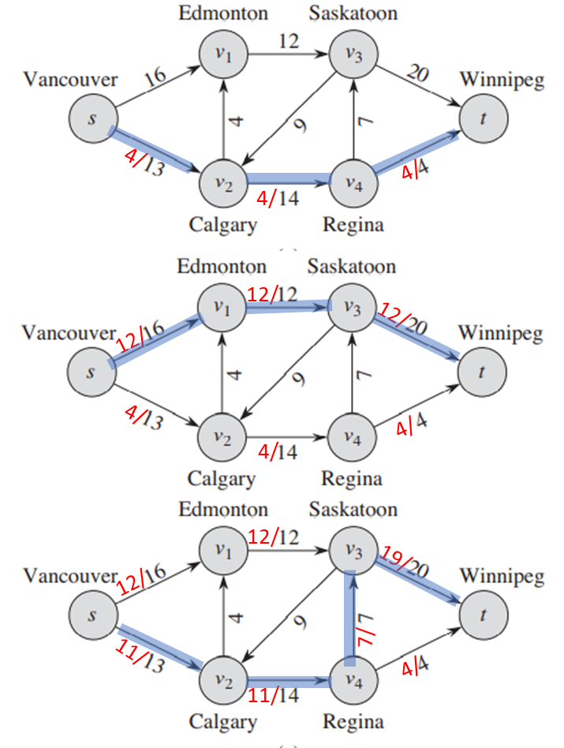
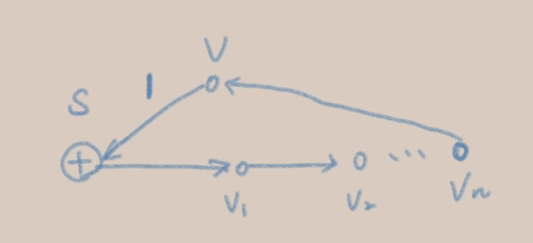

# Algorithmics Homework 13
###### tags: `report` `algorithm`
```
第 7 組
資工二B 109502546 劉語芯
資工二B 109502549 徐瑄琳
資工二B 109502550 許筱敏
資工二B 109502551 葉容瑄
資工二B 109502564 林奕辰
資管二A 109403020 王廷傑
```

### Problem 1

Exercises 26.1-7
Suppose that, in addition to edge capacities, a flow network has vertex capacities. That is each vertex v has a limit $l(v)$ on how much flow can pass through v. Show how to transform a flow network $G = (V, E)$ with vertex capacities into an equivalent flow  network $G’= (V’, E’)$ without vertex capacities, such that a maximum flow in $G’$ has the  same value as a maximum flow in $G$. How many vertices and edges does $G’$ have?

題目：增加了點的流量限制。$G$：有點的流量限制 $G'$：無點的流量限制

Idea
- 把G的點分裂兩點中間連成邊，v $\Rightarrow v_{in},v_{out}$，$v_{in} v_{out}$的邊capcity為v的流量限制$l(v)$，也就是把點上的流量限制轉移到延伸出來的邊上，就能將$G$視為$G'$
- $G=(V,E)$ 則轉換成$G'$後，$G'$會有$2V$個點，$V+E$個邊。
<!--哈囉 你打字讓版面一直動XDDDD 式版面一直往上滑 我超疑惑 沒我也不太想動了
尼豪嗎
衷心感謝 送啦
我考慮遺下不繼續動 ？ 庫哦 阿不然你先把你的題目往上移 我打一夏遊戲XDDD-->
### Problem 2

Exercises 26.2-3
Show the execution of the Edmonds-Karp algorithm on the flow network of Figure 26.1(a).





- $s \Rightarrow v_2 \Rightarrow v_4 \Rightarrow t$
- $s \Rightarrow v_1 \Rightarrow v_3 \Rightarrow t$
- $s \Rightarrow v_2 \Rightarrow v_4 \Rightarrow v_3 \Rightarrow t$

$|f|=23$

### Problem 3

Exercises 26.2-11
The edge connectivity of an undirected graph is the minimum number $k$ of edges that must be removed to disconnect the graph. For example, the edge connectivity of a tree is 1, and the edge connectivity of a cyclic chain of vertices is 2. Show how to determine the edge connectivity of an undirected graph $G = (V, E)$ by running a maximum-flow algorithm on at most $|V|$ flow networks, each having $O(V)$ vertices and $O(E)$ edges.

- 題意
    - edge connectivity: 移除後可讓圖變成不連通的最小邊數$k$
    - 利用maximum-flow algorithm來找到無向圖的 edge connectivity
- 作法
    - step 1: 將無向圖$G$改為有向圖$G^*$，$u,v$ 兩點間有 edge $(u,v)$ 及 $(v,u)$
    - step 2: $f^*(u,v)$ 為 $(u,v)$ 的 maximum flow value，所有edge的capacity為1，所以找到的 maximum flow 同時也是我們需要的 edge connectivity
<!--
- 證明
    - k 為 edge connectivity，並且移除$S$後能夠將$G$分解為$G_1, G_2$
        - $S$ 為 Graph $G$ 的 critical path
    - $u \in G_1, w \in G_2$
    - 根據 max-flow min-cut 定理，$f^*(u,w)$=$(u,w)$間的cut size $\le$k
    - 故：$c^* \le f^*(u,w) \le k$
    - 但 $c^* \le k$ 違反原本對k的設定，所以 $c^*=k$且該演算法能計算出edge connectivity的值
-->
- Pseudocode
    ```=
    EdgeConnectivity:
        for each undireccted edge (u,v):
            add dirrected edge (u,v) and (v,u), set capacity as 1
        for i=0 to |V|-1:
            ford-fulkerson(G,s,t)
        return maxflow // min cut
    ```
<!--
參考資料：https://www.csie.ntu.edu.tw/~r95122/alg07spr/alg07spr_hw3sol.pdf
-->
### Problem 4

Exercises 26.2-13
Suppose that you wish to find, among all minimum cuts in a flow network $G$ with integral capacities, one that contains the smallest number of edges. Show how to modify the capacities of $G$ to create a new flow network $G’$ in which any minimum cut in $G’$ is a minimum cut with the smallest number of edges in $G$.

題意：改圖使找到的minimum cut必為有最小邊數的minimum cut
#### answer
- Assume graph $G$ contains $n$ edges
- $c(e')=c(e)\times n + 1$, which $e$ is the edge in $G$ and $e'$ is the edge in $G'$
#### proof
- For any cut $S'$, $c(S')=c(S)\times n+ \text{the number of edges}$
- Assume a minimum cut $X$, $c(X)=x\Rightarrow c(X')=n\times x+ a$.
    If there exist a cut $Y$, which $c(Y)=y\lt c(X)=x$ and $c(Y')=n\times y+b$ 
    $c(Y')=n\times y + b\le n\times (y+1)\le n\times x\lt n\times x+ a=c(X')$
    $\Rightarrow$  contradiction
- Assume a minimum cut $X$ and $X$ contain smallest number of edges, $c(X)=x\Rightarrow c(X')=n\times x+ a$.
    If there exist a minimum cut $Y$, which contain less edges than $X\Rightarrow c(Y')=n\times y+b,\ b\lt a$ 
    $c(Y')=n\times y + b\lt n\times x+ a=c(X')$
    $\Rightarrow$  contradiction
<!--
[參考](https://stackoverflow.com/questions/44523928/modification-in-the-ford-fulkerson-method)
[參考2](https://ac.informatik.uni-freiburg.de/teaching/ws16_17/algo1617/solutions/algo_exercise05_solution.pdf)
-->

### Problem 5

The vertex connectivity 𝜅(G) of a graph G is the minimum size of a vertex cut, i.e., a vertex subset S ⊆ V(G) such that G − S is disconnected or has only one vertex.For example, the vertex connectivity of a tree is 1, and the vertex connectivity of a cyclic chain of vertices is 2. Show how to determine the vertex connectivity of an undirected graph $G = (V, E)$ by running a maximum-flow algorithm on at most $|V|$ flow networks, each having $O(V)$ vertices and $O(E)$ edges.


It's a min cut problem with all edge has 1 as max flow. 
- maximum-flow can find the min cut for a s-t cut
- for any point in the graph, there must be at least one point is on the other side of the min s-t cut.
- So choose one vertex in the graph as fixed source, and run every other vertices as target, the minimal flow of all s-t cut is the min cut of the graph
- Algorithm: Run maximum-flow for $|2V-1|$ time so the time complexity is $O(V^2(V+E))$ 
<!-- if we use Edmonds-Karp that takes $O(VE^2)$ each time  -->

```python=
Edmonds-Karp(G, s, t):
    capacity = 0
    while true:
        path=findShortestAugmentingPath(G, s, t)
        if path!=null:#null means no capacity can be added
        capacity+=path.minimalEdgeCapacity
    return capacity

findConnectivity(G):
    // modified graph G->g
    for each v in G.V:
        g[v_in, v_out] = 1
        g[v_out, v_in] = 1
    for each (u,v) in G.E:
        g[u_out, v_in] = ∞
        g[v_out, u_in] = ∞
    
    minimal=inf, s=1
    for t in g.V and t!=s:
        minimal=min(minimal,Edmonds-Karp(G, s, t))
    return minimal
```

### Problem 6

EXT 10-1
There are two extended ways used to find the augmenting path that we have mentioned in class (refers to slides p.14, Unit 10), please design an efficient algorithm with the argument of second method to find the augmenting path. Argue that your algorithm is correct and also analyze the time-complexity.

- $dp[s] \text{denote the max capacity from s to t }$
- $w(u, v) \text{ denote the left(剩下可增加的) capacity of edge uv }$
- $\text{Initial}:dp[s]_{∀s ∈G.V}=0 ,dp[t]=∞$
- $\text{Recursive form}:$
 $dp[u] =max(min(w(u, v), dp[v]))，\forall v \in Adj[u]$


```python=
DFS(G, u):
    if visited[u]: return dp[u]
    visited[u]=True
    for v in G.adj[u]:
        if !visited[v]:DFS(G, v)
            capacity=min(w(u, v), dp[v])
        if capacity > dp[u]:
            next[u] = v
            dp[u] = capacity
    return dp[u]

FindMaxCapacityAugmentingPath(G, s, t):
    for v in G.V:
        dp[v] = 0, visited[v]=False, next[v]=NIL 
    dp[t]=inf
    visited[t]=True
    maxCapacity = DFS(G, s)
    path=[s],currentPoint=s
    while currentPoint!=t:
        path.append(next[currentPoint])
        currentPoint=next[currentPoint]
    return maxCapacity, path
```

Time complexity: $O(|V|+|E|)$ since that's a DFS

### Problem 7

Exercise 26.2-12
Suppose that you are given a flow network $G$, and $G$ has edges entering the source $s$. Let $f$ be a flow in $G$ in which one of the edges $(v, s)$ entering the source has $f(v, s)=1$. Prove that there must exist another flow $f'$ with $f'(v, s) = 0$ such that $|f|=|f'|$. Give an $O(E)$-time algorithm to compute $f'$, given $f$ , and assuming that all edge capacities are integers




Flow Conservation: 

根據 **flow conservation**，可知對於 source & sink 外的所有點，每個點的淨流量為0。

題目給定一個點 $v$，使得存在$f(v,s)=1$，根據 flow conservation，$v$ 的 inflow $\ge 1$；由於 $s$ 是 source，則 $s$ 必至少向外指到一個點，因此，我們可以在此圖 $G$ 中找到一個環($s\rightarrow v_1 \rightarrow v_2 \rightarrow \dots \rightarrow v \rightarrow s$)，且環上的每一邊 flow 皆 $\ge 1$。
對此環上每一邊的 flow 皆 -1，可得一 $f'$ 使得 $f'(v,s) = 0$ 且 $|f| = |f'|$，故得證。

```python=
// Graph:G, flow:f, source:s
vis[1...|V|] <- false
bool dfs(u):
    vis[u] <- true
    for v in adj[u]:
        if v==s && f[u,v] == 1:
            f[u,v]--
            return true
        if !vis[v] && dfs(v):
            if f[u,v] > 0:
                f[u,v]--
                return true
    return false
```
time complexity:
dfs->$O(V+E) = O(E)(V\le E)$
