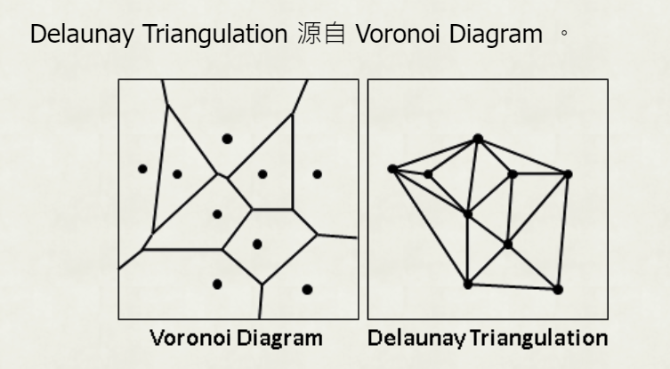
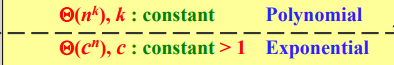
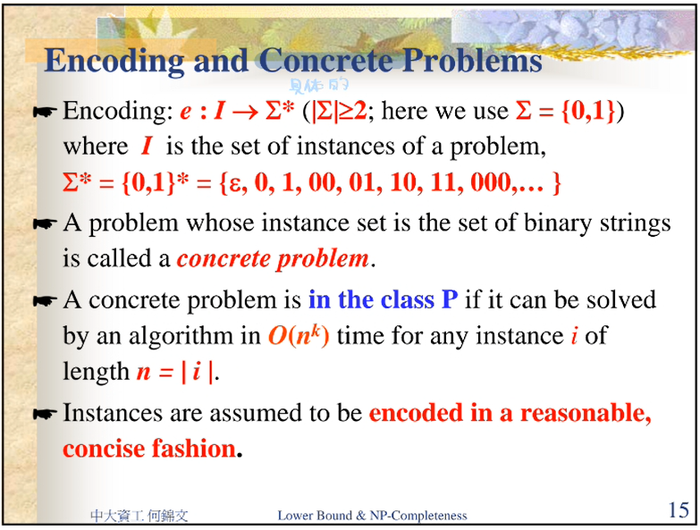

# Algorithmics Homework 14
###### tags: `report` `algorithm`
```
第 7 組
資工二B 109502546 劉語芯
資工二B 109502549 徐瑄琳
資工二B 109502550 許筱敏
資工二B 109502551 葉容瑄
資工二B 109502564 林奕辰
資管二A 109403020 王廷傑
```
### Problem 1

Show that any comparison-based algorithm needs $\Omega(n \log n)$ time to solve the following problem: Given $n$ points in the 2D plane, construct a tree of minimum total length whose vertices are the given points and the edge length of an edge is the Euclidean distance between the two end points of the edge.


A reduce to B (A≻B) 代表B比較難做
而A的input可以透過某種轉換變為B問題的input ( $A\rightarrow A', A' \in B$ )，而B問題也的確可以解決這個問題，則所有A的問題都可以被包含在B中，A的lowerbound就會等於B的lowerbound

1. 對於 sorting 問題給定 input: $x_1, x_2, x_3, ...$
2. $x_1, x_2, x_3, ... \rightarrow (x_1,x_1), (x_2,x_2), (x_3,x_3), ...$ 
    $\Rightarrow$ need $O(n)$ to transfer $A$ to $A'$
3. Run EMST of $(x_1,x_1), (x_2,x_2), ...$
4. 選定最左邊的點作為 root，依序輸出整棵EMST，可得到 sorting 後的結果
    $\Rightarrow$ need $O(n)$ transfer $A'$ to $A$

$\because$ 基於比較的排序演算法下界為 $\Omega(n\log n)$
$\therefore$ 任何基於排序的演算法要 $\Omega(n\log n)時間解決EMST$


<!-- 首先 reduce sorting 問題到 EMST(euclidean minimum spanning tree) 問題。
假如 sorting 問題的輸入是 $x_1, x_2, x_3, ...$，存在一個對應的EMST問題，其中每個點的座標是 $(x_1,x_1), (x_2,x_2), ...$，轉換的時間為$O(n)$，EMST的答案中樹的兩端點是最大端與最小端，從隨意一端開始輸出，$O(n)$的時間可以轉回sorting的答案，基於比較的排序演算法下界$\Omega(n\log n)$，所以我們可以說，任何基於排序的演算法要$\Omega(n\log n)時間解決EMST$。 -->

- EMST pseudo code
```
1. 計算 Delaunay triangulation，產生一張圖 G，花 O(nlogn)
2. 將邊權重設為邊的幾何長度
3. 跑 MST algorithm，有O(n)個邊，所以至少要O(nlogn)
```


ref. [EMST Wiki](https://en.wikipedia.org/wiki/Euclidean_minimum_spanning_tree)、[Delaunay triangulation](https://web.ntnu.edu.tw/~algo/Neighbor.html#2)、[前人的紀錄](https://hackmd.io/iKdVdYWlTdWR_CrIQUL2Qw?view)、[Morris' 計算幾何](https://morris821028.github.io/2014/11/28/lesson/geometry-hw4/)

### Problem 2

Exercises 34.1-5
Show that if an algorithm makes at most a constant number of calls to polynomial-time subroutines and performs an additional amount of work that also takes polynomial time, then it runs in polynomial time. Also show that a polynomial number of calls to polynomial-time subroutines may result in an exponential-time algorithm.


Suppose subroutine $S_1,S_2,...,S_m$, each $S_i$ running time bounded by $p_i(n) \le n^k$ 
worst case為每個subroutine都和前個subroutine相關

- constant number of calls to polynomial-time subroutine
    - $S_i=p^i(n)=p(p(...(p(n))...)=n^{k^i}$
    - $O(\sum\limits_{i=1}^{m} p_i(n)) = O(mp^m(n))=O(mn^{k^m})$，為polynomial time
- polynomial number of calls to polynomial-time subroutine
    - simply makes n nested calls to a subroutine S, on input n (讓call的次數達到$O(n)$)
    $S^n(n)=S(S(...(S(n))...)$
    - Suppose that S takes linear time and that its return value is twice as long as its input.<!-
It follows that the running time and the size of the return value of the i-th call are both $\Theta(n2^i)$
    - $\Theta (n\sum\limits_{i=1}^{n} 2^i) = \Theta (n2^n)$，為exponential time
<!--
準確來說是讓call number達到O(mn)因為m是常數所以把m幹掉ㄌ
然後由於worst case還是跟著上面的定義走，所以當return value是兩倍的input長的時候
就可以看成
S_i_j 0<i<m，是原本的m個routine; 0<j<n，是這題設置的
n nestedcall
S_i_j=p^{(i-1)*n+j}(n)=>每個p(n)是2 所以每個call(提出來看)就是2^i 
Size要在乘上原本的input n，所以就會是n2^i
-->


[參考](http://www.dei.unipd.it/~geppo/DA2/DOCS/npcompleteness.pdf)
<!--

嘎U 我先滾了 晚安
我也要滾了XDDDD 灣安-->
### Problem 3

Exercises 34.1-6
Show that the class $P$, viewed as a set of languages, is closed under union, intersection, concatenation, complement, and Kleene star. That is, if $L_1, L_2 \in P$, then $L_1 ∪ L_2 ∈ P,\ L_1 ∩ L_2 ∈ P,\ L_1L_2 ∈ P,\ \overline L_1∈ P$, and $L_1^* ∈ P$.



$P$：可以用polynomial-time解的題目($O(n^c), c \in R)$。
如果$L_1, L_2 \in P$，則存在一機器$M_1$使$L_1$時間複雜度 = $O(n^k), k \in R$，也存在一機器$M_2$使 $L_2$時間複雜度 = $O(n^l), l \in R$

1. Union $L_1 \cup L_2$
    - $M(w)$:
        1. Run $M_1(w)$, if $M_1$ accept $w$, then $accept$ 
        2. Run $M_2(w)$, if $M_2$ accept $w$, then $accept$ 
    - 時間複雜度：$O(n^{max(k, l)})\rightarrow$ polynomial-time得證

2. Intersection $L_1 \cap L_2$
    - $M(w)$:
        1. Run $M_1(w)$, if $M_1$ accept $w$, then run $M_2(w)$, else $reject$
        2. If $M_2$ also accept $w$, then $accept$, else $reject$ 
    - 時間複雜度：$O(n^{max(k, l)})\rightarrow$ polynomial-time得證

3. Concatenation $L_1L_2$
    - Input $w = a_1a_2a_3...a_n, a_i \in \Sigma$
    - $M(w)$:
        1.  For $i = 0,1,2, ... , n$
        2.  Run $M_1(w_1 = a_1a_2...a_i)$ and 
            run $M_2(w_2 = a_{i+1}a_{i+2}...a_n)$
            If both $M_1$ and $M_2$ accept $w$, then $accept$
        3. If none of the iterations in Stage 2 accept, then $reject$ 
    - 時間複雜度：$O(n\cdot n^{max(k, l)})\rightarrow$ polynomial-time得證

4. Complement $\overline L_1$
    - $M(w)$:
        1. Run $M_1(w)$, if $M_1$ accept $w$, then $reject$, else $accept$ 
    - 時間複雜度：$O(n^k)\rightarrow$ polynomial-time得證

5. Kleene star $L_1^*$
    - Input $w = w_1w_2w_3...w_n$
    - pseudocode
    ```python=
    M(w):
        // dp[i] = if w1w2...wi ∈ L1*
        for i = 1 to n:
            dp[i] = false
        dp[0] = 1 // M(ϵ) = true

        for i = 1 to n: // 長度為i時
            for j = 0 to i-1:
                if dp[j] && M1(wj+1...wi):
                    dp[i] = true
        return dp[n]
    ```
    - 時間複雜度：$O(n^2\cdot n^k)\rightarrow$ polynomial-time得證
<!--  -->
<!--  -->

### Problem 4

Exercises 34.2-3
Show that if HAM-CYCLE ∈ P, then the problem of listing the vertices of a hamiltonian cycle, in order, is polynomial-time solvable. 
(Note 1: HAM-CYCLE is defined as “Does a graph G have a Hamiltonian cycle?”)
(Note 2: “HAM-CYCLE ∈ P” means that HAM-CYCLE is polynomial-time solvable.)

- 題意：當判斷一個圖是否為 hamiltonian cycle 的時間複雜度是 polynomial-time，則依序列出 hamiltonian cycle 中 vertex 的時間複雜度也是 polynomial-time
- hamiltonial cylce --- a simple cycle that contains each vertex in $G$
- idea
    - choose any vertex as source
    - $G'$ is a graph that delete the vertex's edge $(u,v)$
    - if $G'$ is not hamiltonian cycle, then the edge $(u,v$) is in the cycle, and $v$ is the next vertex in order.
- pseudo code
    ```phthon=
    listHamCycleVertex:
        Ans[n]
        u <- s // s is the source of the graph
        Ans[0] <- u
        while |Ans| != n:
            for v in adj[u]:
                G' = G-e(u,v)
                if HAM-CYCLE(G'): G <- G'
                else:
                    add v to Ans
                    delete other edges of u
                    u <- v
        add s to Ans
        print Ans
    ```
- time complexty: 
    - if time complexity of HAM-CYCLE is $O(n^k)$
    - time complexity of *listHamCycleVertex* is $O(En^k) \in P$

### Problem 5

Exercises 34.2-7
Show that the Hamiltonian-path problem can be solved in polynomial time on directed acyclic graphs. Give an efficient algorithm for the problem.

> hamiltonian path：a simple path that visits every vertex exactly once
- idea
    1. topologically sort the graph
    2. check whether all the adjacent vertices are connected in the topologically sorted graph
- pseudocode
```python=
Topsort(G):
    T <- empty list   //stores the topsort
    Z <- empty queue    //stores vertices with indegree 0
    in[] <- {0}     //store indegree of each vertex
    for each v in V:
        for each u in v.adjacency:
            in[u]++
    for each v in V:
        if(in[v]==0): Z.push(v)
    while(!Z.empty()):
        v = Z.pop()
        T.append(v)
        for each u in v.adjacency:
            in[u]--
            if(in[u]==0) Z.push(u)
    return T
    
CheckHamiltonianPath(G, T):
    for i=0 to |V|-2:
        if(T[i+1] not in T[i].adjacency): return false
    reture true
```
- analysis
    Time complexity = $T(Toposort)+T(Check)=O(|V|+|E|)$
<!--- [參考1](https://www.es.ele.tue.nl/education/5MC10/Solutions/NP-completeness_II.pdf)
- [參考 Topsort](http://ozark.hendrix.edu/~yorgey/382/static/topsort.pdf)

哈囉你好嗎衷心感謝 看之前ㄉ作業？
我不知道怎麼寫拓樸排續QQ 看不懂 喔喔感謝

-->

### Problem 6

Exercise 34.2-1
Consider the language GRAPH-ISOMORPHISM = $\{<G_1, G_2>: G_1 \text{ and } G_2 \text{ are isomorphic graph}\}$. Prove that GRAPH-ISOMORPHISM ∊ NP by describing a polynomial-time algorithm to verify the language.


algorithm: given an $\text{function (which is the certificate y) }f(x) \text{ that map a vertex in G1 to a vertex in G2}$, verify whether the relationship cause isomorphism graph

```python=
verify(G1, G2, f):
    if |G1.V|!=|G2.V| or |G1.E|!=|G2.E|:
        return False
    record[w]= False for all w in G2.V:
    for v in G1.V: record[f(v)]=True
    for v in G2.V:
        if !record[v]: return False
    for v in G1.V:
        record[w]= False for all w in G2.V:
        for u in G1[v]:
            record[f(u)]=True
        for u in G2[f(v)]:
            if !record[u]:
                return False
    return True
```

time complexity: $O(V+E)$ since line 4-7 (verifying one-to-one on f) require $O(V)$ and line 8-14 (verifying edges) require at most $2E+V=O(V+E)$
### Problem 7

Exercise 34.1-2
Consider the problem of finding the longest simple cycle in an undirected graph.Give a related decision problem.Show the decision problem is an NP problem.

Consider each instance of a graph with the longest simple cycle contained in that graph. 
The decision problem is, given $k$, to determine whether or not the instance graph has a simple cycle of length at least $k$. If yes, output 1. Otherwise output 0.

Given a certificate y , which is a sequence of vertice($v_1,v_2..v_n$) ,Verifying whether n>=k and y is a cycle or not , scan the Graph(polynomial time),each vertex in y can be scanned once

ref:[參考](
https://stackoverflow.com/questions/53908337/example-of-longest-path-problem-having-a-np-complexity)
<!--尼豪 我好了 不會再動ㄌXDDDD ㄅㄅㄅㄅ-->