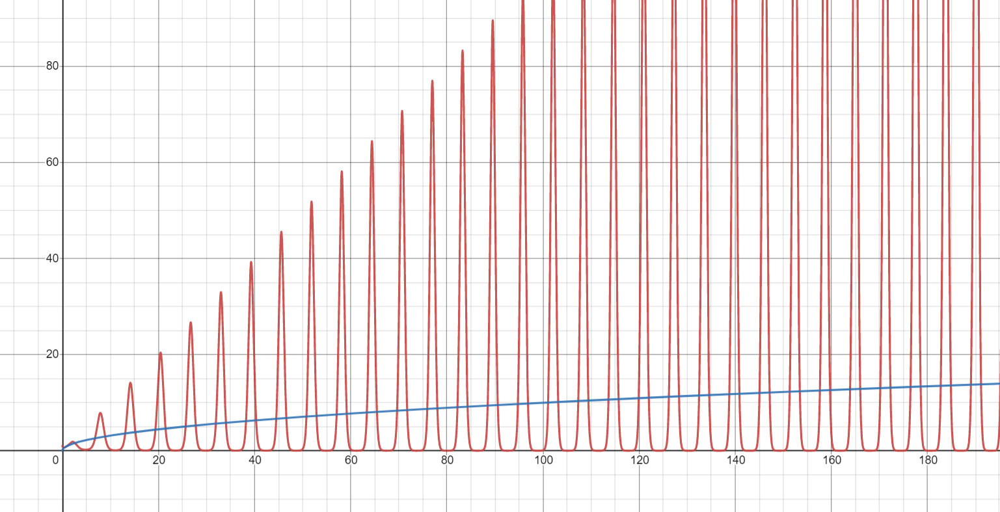
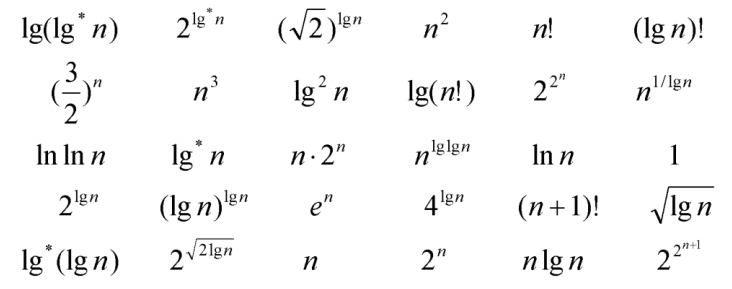

# Algorithmics Homework 2
###### tags: `report` `algorithm`
```
第 7 組
資工二B 109502546 劉語芯
資工二B 109502549 徐瑄琳
資工二B 109502550 許筱敏
資工二B 109502551 葉容瑄
資工二B 109502564 林奕辰
資管二A 109403020 王廷傑
```

### Problem 1
Indicate, for each pair of expressions (A, B) in the table below, whether A is O, o, Ω, ω, or Θ of B. Assume that k ≥ 1, ε > 0, and c > 1 are constants. Your answer should be in the form of the table with "yes" or "no" written in each box.

> $A = O(B)$
let T=Yes, F=No

||A|B|$O$|$o$|$\Omega$|$\omega$|$\Theta$|
|--|---|---|----|---|---|---|---|
|a|$\lg^k{n}$|$n^\epsilon$|T|T|F|F|F|
|b|$n^k$|$c^n$|T|T|F|F|F|
|c|$\sqrt{n}$|$n^{\sin{n}}$|F|F|F|F|F|
|d|$2^n$|$2^{n/2}$|F|F|T|T|F|
|e|$n^{\lg{c}}$|$c^{\ln{n}}$|F|F|T|T|F|
|f|$\lg{n!}$|$\lg(n^n)$|T|F|T|F|T|

note.
e. $c^{\ln{n}}=c^{\frac{\ln{n}\ln{c}}{\ln{c}}}=c^{\log_c{n}\ln{c}}=n^{\ln{c}} \rightarrow c>1 ,\lg{c}>\ln{c}$
f. $\lg{n!}=\lg{n(n-1)(n-2)...(1)}= \displaystyle\sum^n_{i=1}{\lg(x)}$
$\rightarrow\int^n_1{\lg(x)dx}\le\sum^n_{i=1}\limits{\lg(x)}\le \int^{n+1}_{1}\lg(x)dx$
$\rightarrow x\lg{x} \mid^n_1\le\displaystyle\sum^n_{i=1}{\lg(x)}\le x\lg{x} \mid^{n+1}_1$
$\rightarrow \lg{n!}=O(n\lg{n})$
<!--
乾為啥右邊積分特別肥誰救我一下
fixed [name=大俠]
哦哦好讚
所以是\displaystyle鍋嗎
度
cool
-->

### Problem 2 
Given two non-negative function $f, g$ (i.e. $f, g : N \to R^*$) such that $f\not= O(g)$, $f\not= \Theta (g)$, and $f\not= \Omega (g)$.

由第一題c.可得：
$f(n)=\sqrt n$
$g(n)$要找不會收斂的，就不會形成upper bound, lower bound.
$g(n)=n^{\sin{n}}$



### Problem 3
a. Rank the following functions by order of growth; that is, find an arrangement $g_1, g_2, …, g_{30}$ of the functions satisfying $g_1 = Ω(g_2), g_2 = Ω(g_3), …, g_{29} = Ω(g_{30})$. Partition your list into equivalence classes such that functions $f(n)$ and $g(n)$ are in the same class if and only if $f(n) = \Theta (g(n))$.


b. Give an example of a single nonnegative function $f(n)$ such that for all functions $g_i(n)$ in part (a), $f(n)$ is neither $O(g_i(n))$ nor $\Omega(g_i(n))$.

#### a )
我們可以將這些函式依增長快慢分成五個類別：power tower、factorial、exponential、polynomial & logarithmic、constant & iterated logarithm.
(Let $\lg n = k \Rightarrow 2^k = n$.)

- power tower: $a^{a^{\dots^a}}$
	- $g_{1} = 2^{2^{n+1}} = 2^{2\cdot 2^{n}} = 4^{2^n}$
	- $g_{2} = 2^{2^n}$
- factorial: $n!$、$n^n$
	- $g_{3} = (n+1)! = (n+1)\cdot n!$
	- $g_{4} = n!$ 
- exponential: $k^n$
	- $g_{5} = e^n$
	- $g_{6} = n \cdot 2^n$
	- $g_{7} = 2^n$
	- $g_{8} = (\dfrac32)^n$
- polynomial & logarithmic: $n^k$、$\lg n$
	- $\Theta((\lg n)^{\lg n})$
		- $g_{9} = n^{\lg \lg n} \rightarrow^{(取\lg)} \lg\lg n\cdot\lg n$
		- $g_{10} = (\lg n)^{\lg n} \rightarrow^{(取\lg)} \lg n\cdot\lg\lg n$
		- $g_{11} = (\lg n)! \approx (\lg n)^{\lg n}$
	- $g_{12} = n^3$
	- $\Theta(n^2)$
		- $g_{13} = n^2$
		- $g_{14} = 4^{\lg n} = 4^k = 2^k\cdot 2^k = n^2$
	- $\Theta(n\lg n)$
		- $g_{15} = n\lg n$
		- $g_{16} = \lg (n!)$
	- $\Theta(n)$
		- $g_{17} = n$
		- $g_{18} = 2^{\lg n} = 2^k = n$
	- $g_{19} = (\sqrt2)^{\lg n} = (\sqrt2)^k = 2^{\frac k2} = n^\frac12 = \sqrt n$
	- $g_{20} = 2^{\sqrt{2\lg n}} \rightarrow^{(取\lg)}\sqrt{2k}$
	- $g_{21} = \lg^2 n \rightarrow^{(取\lg)}2\lg k$
	- $g_{22} = \ln n$
	- $g_{23} = \sqrt{\lg n}$
	- $g_{24} = \ln (\ln n)$ 
- constant & iterated logarithm: $c$、$\lg^* n$
	- $g_{25} = 2^{\lg^* n}\rightarrow^{(取\lg)}\lg^* n$
	- $g_{26} = \lg^* n$
	- $g_{27} = \lg^* (\lg n) = \lg^* n - 1$
	- $g_{28} = \lg (\lg^* n)$
	- $\Theta(c)$
		- $g_{29} = n^{\frac1{\lg n}} = 2^{k \cdot \frac1k} = 2$
		- $g_{30} = 1$
#### b )
- 在所有$g_i(n)$中增長速率最快為$2^{2^{n+1}}$，最慢為$1$
- $1+\sin n$為一在$0$ ~ $2$間震盪之週期函數
- 令$f(n) = (1+\sin n)\cdot 4^{4^{n}}$，則 $f(n)$ 滿足 $f(n) \notin O(g_i(n)) \cap f(n) \notin \Omega(g_i(n))$

<!-- 害大俠 a.m. 00:20
害大俠 a.m. 12:20 -->
### Problem 4
Let $f(n)$ and $g(n)$ be asymptotically positive functions. Prove or disprove each of the following conjectures.
a. $f(n) = O(g(n))$ implies $g(n) = O(f(n))$.
b. $f(n) + g(n) = \Theta (min( f(n), g(n))$.
c. $f(n) = O(g(n))$ implies $\lg(f(n)) = O(\lg(g(n)))$, where $\lg(g(n)) \ge 1$ and $f(n) \ge 1$ for all sufficiently large n.
d. $f(n) = O(g(n))$ implies $2^{f(n)}= O(2^{g(n)})$.
e. $f(n) = O((f(n))^2)$.
f. $f(n) = O(g(n))$ implies $g(n)= \Omega (f(n))$.
g. $f(n) = \Theta (f(n/2))$.
h. $f(n) + o(f(n)) = \Theta (f(n))$.
i. $f(n) = \Theta (g(n))$ implies $f(n)/g(n)=c\not= 0$


#### a. $f(n) = O(g(n))$ implies $g(n) = O(f(n))$.

$f(n)=O(g(n)) \Rightarrow$ $f(n) \le c·g(n)$
$\Rightarrow (n)\ge \dfrac{1}{c}g(n)\Rightarrow g(n)=\Omega (f(n))$

Ans: False

#### b.$f(n) + g(n) = \Theta (min( f(n), g(n)))$.

let $f(n)=n,\ g(n)=n^2$
$\Rightarrow f(n)\in \Theta(n), g(n)\in \Theta(n^2)$
$\Rightarrow f(n)+g(n) = n^2 + n \notin \Theta(min(f(n),g(n))) = \Theta(n)$

Ans:False

#### c. $f(n) = O(g(n))$ implies $\lg(f(n)) = O(\lg(g(n)))$, where $\lg(g(n)) \ge 1$ and $f(n) \ge 1$ for all sufficiently large n.

Let $f, g: N \to R^+$
$O(g(n))$ denote the set {$f(n): \exists \ n_0 \in N \ni \forall n \ge n_0, f(n) \le c．g(n)$}
$f(n) \le c．g(n)$
$lg(f(n)) \le \ lg(c．g(n)) \Rightarrow \lg c +\lg n)$ （已知）
If $c<1 \Rightarrow \lg c<0$

試證 $\lg(f(n)) \le \ d．\lg(g(n)) \leftrightarrow \lg(f(n)) \in O(\lg(g(n)))$
$d= \frac{\lg g(n)+\lg c}{\lg g(n)}=1+ \frac{\lg c}{\lg g(n)}$
$\because \lg g(n) \ge 1$
$\therefore 1+\frac{\lg c}{\lg g(n)} \le 1+\lg c$
$\Rightarrow \lg f(n) \le (1+\lg c)·\lg g(n)$
$\Rightarrow \lg f(n) \in O(\lg g(n))$

Ans: True

#### d. $f(n) = O(g(n))$ implies $2^{f(n)}= O(2^{g(n)})$.

Counter example: $f(n)=2n,\ g(n)=n$
$\Rightarrow 2^{2^n}=4^n \ne O(2^n)$

Ans: False

#### e. $f(n) = O((f(n))^2)$.
There is a counter example : $f(n)=\dfrac{1}{n}$.
$\to f^2(n) = \dfrac{1}{n^2}$
$\to \displaystyle\lim_{n\to\infty} \dfrac{f(n)}{f^2(n)}=n$ --- By definition, $f(n) \ne O((f(n))^2)$.

Ans: False

#### f. $f(n) = O(g(n))$ implies $g(n)= \Omega (f(n))$.
$f(n)=O(g(n))\to f(n) \le c·g(n)\to g(n) \ge \dfrac{1}{c}·f(n)\to g(n)= \Omega (f(n))$.

Ans: True
#### g. $f(n) = \Theta (f(\dfrac{n}{2}))$.
There is a counter example: $f(n)=2^n\to f( \dfrac{n}{2})=2^\frac{n}{2}$
$\displaystyle\lim_{n\to\infty} \dfrac{f(n)}{f(\dfrac{n}{2})}= \displaystyle\lim_{n\to\infty} \dfrac{2^n}{2^\frac{n}{2}}=  \displaystyle\lim_{n\to\infty} 2^\frac{n}{2}=\infty$
By definition, $f(n) \ne \Theta (f(n/2))$

Ans: False
#### h. $f(n) + o(f(n)) = \Theta (f(n))$.
- let $g(n)=o(f(n))$, it means that $0\le g(n)\le c·f(n)$
- $f(n) = \Theta (f(n))$ when $c_1·f(n)\le f(n)\le c_2·f(n)$
- $g(n)+f(n) = f(n)+o(f(n))=\Theta(f(n))$ because $c_1f(n)\le f(n)+g(n)\le (c+c_2)f(n)$

Ans: True

#### i. $f(n) = \Theta (g(n))$ implies $f(n)/g(n)=c\not= 0$

$f(n) = \Theta (g(n))$ means that $c_1·g(n)\le f(n)\le c_2·g(n),  \exists c_1, c_2\in R^+$

Counter example: $f(n)=\sin n+2,\ g(n)=1$
$\Rightarrow 1 \le f(n) \le 3$
$\Rightarrow 1·g(n) \le f(n) \le 3·g(n)$ which satisfies the definition of $f(n)=\Theta(g(n))$
However, $\displaystyle\lim_{n\to\infty} \dfrac{f(n)}{g(n)}=\sin n+2 \ne c$

Ans: False
### Problem 5
Solve the recurrence $T (n) = 2T (\sqrt {𝑛}) +1$ by making a change of variables. Your solution should be asymptotically tight. Do not worry about whether values are integral.

- $\text{let } n =2^m$
    $T(2^m)=2T(2^{\frac {m}{2}})+1$
    $let\ S(m)=T(2^m)$
    $S(m)=2S(m/2)+1$
    By master theorem($a=2,b=2,k=0$)
    $0<\log_22=1$
    $S(m)=T(2^m)=T(n)=\Theta (m)=\Theta(\lg n)$
    $T(n)=\Theta(\lg n)$
    

### Problem 6
Give asymptotic upper and lower bounds for $T(n)$ in each of the following recurrences. Assume that $T(n)$ is constant for $n\le 2$. Make your bounds as tight as possible, and justify your answers.
a. $T(𝑛) = 2𝑇 (\dfrac{𝑛}{2}) + 𝑛^3$
b. $𝑇(𝑛) = 𝑇 (\dfrac{9𝑛}{10}) + 𝑛$
c. $𝑇(𝑛) = 16𝑇 (\dfrac{𝑛}{4}) + 𝑛^2$
d. $𝑇(𝑛) = 7𝑇 (\dfrac{𝑛}{3}) + 𝑛^2$
e. $𝑇(𝑛) = 7𝑇 (\dfrac{𝑛}{2}) + 𝑛^2$
f. $𝑇(𝑛) = 2𝑇 (\dfrac{𝑛}{4}) + \sqrt {n}$
g. $𝑇(𝑛) = 𝑇(𝑛 − 1) + 𝑛$
h. $𝑇(𝑛) = 𝑇(\sqrt {𝑛}) + 1$

#### a. $𝑇(𝑛) = 2𝑇 (\dfrac{𝑛}{2}) + 𝑛^3$
- By the master theorem
    $f(n)=n^3=\Theta (n^3)$ 
    $\because k=3\gt \log_{b}{a}=\lg{2}=1$
    $\Rightarrow a\cdot f(\dfrac{n}{b})=\dfrac{n^3}{4}<c\cdot n^3 =c\cdot f(n),\  \forall c>\dfrac14$
    $\therefore T(n)=\Theta (n^3)$  
#### b. $𝑇(𝑛) = 𝑇 (\dfrac{9𝑛}{10}) + 𝑛$
- By the master theorem
    $f(n)=n=\Theta (n)$ 
    $\because k=1\gt \log_{b}{a}=\log_{\frac{10}{9}}{1}$
    $\Rightarrow a\cdot f(\dfrac nb)=\dfrac{9n}{10}<c\cdot n=c\cdot f(n),\ \forall c>\dfrac 9{10}$
    $\therefore T(n)=\Theta (n)$

#### c. $𝑇(𝑛) = 16𝑇 (\dfrac{𝑛}{4}) + 𝑛^2$
- By the master theorem
    $f(n)=n^2=\Theta (n^2)$ 
    $\because k=2\ =\ \log_{b}{a}=\log_{4}{16}=2$
    $\therefore T(n)=\Theta (n^2\lg n)$

#### d. $𝑇(𝑛) = 7𝑇 (\dfrac{𝑛}{3}) + 𝑛^2$
- By the master theorem
    $f(n)=n^2=\Theta (n^2)$ 
    $\because k=2\gt \log_{b}{a}=\log_{3}{7}$
    $\Rightarrow a\cdot f(\dfrac nb)=7\cdot\dfrac {n^2}9<c\cdot n^2=c\cdot f(n),\ \forall c>\dfrac79$
    $\therefore T(n)=\Theta (n^2)$

#### e. $𝑇(𝑛) = 7𝑇 (\dfrac{𝑛}{2}) + 𝑛^2$
- By the master theorem
    $f(n)=n^2=\Theta (n^2)$ 
    $\because k=2\lt \log_{b}{a}=\lg{7}$
    $\therefore T(n)=\Theta (n^{\lg{7}})$

#### f. $𝑇(𝑛) = 2𝑇 (\dfrac{𝑛}{4}) + \sqrt {n}$
- By the master theorem
    $f(n)=\sqrt {𝑛}=\Theta (\sqrt {𝑛})$ 
    $\because k = \dfrac{1}{2}\ =\ \log_{b}{a}=\log_{4}{2}=\dfrac{1}{2}$
    $\therefore T(n)=\Theta (\sqrt{n}\lg n)$

#### g. $𝑇(𝑛) = 𝑇(𝑛 − 1) + 𝑛$
$\begin{split}
𝑇(𝑛) &= 𝑇(𝑛 − 1) + 𝑛 \\
    &=T(n-2)+(n-1)+n\\
    &=T(n-3)+(n-2)+(n-1)+n\\
    &...\\
    &=T(2)+3+4+5+...+(n-2)+(n-1)+n\\
    &=T(2)+\dfrac{(n+3)(n-2)}{2}\\
    &=\Theta (n^2)
\end{split}$
#### h. $𝑇(𝑛) = 𝑇(\sqrt {𝑛}) + 1$
- Let $n=2^m,\ S(m)=T(2^m)$
    $S(m)=S(\dfrac{m}{2})+1$
    By the master theorem
    $f(n)=1=n^0$
    $\because k=0\ =\ \log_{b}{a}=\lg{1}=0$
    $\begin{split}
    \therefore S(m)&=\Theta (m^0\lg m)=\Theta (\lg m)\\
    T(n) &=S(\lg n)=\Theta (\lg \lg n)
    \end{split}$

### Problem 7
Give asymptotic upper and lower bounds for T(n) in each of the following recurrences.
Assume that T(n) is constant for sufficiently small n. Make your bounds as tight as possible, and justify your answers.
a. $𝑇(𝑛) = 4𝑇 (\dfrac{n}{3}) + n \lg n$
b. $𝑇(𝑛) = 3𝑇 (\dfrac{n}{3}) +\dfrac{n}{\lg n}$
c. $𝑇(𝑛) = 4𝑇 (\dfrac{n}{2}) + 𝑛^2\sqrt{𝑛}$
d. $𝑇(𝑛) = 3𝑇 (\dfrac{n}{3}-2) +\dfrac{n}{2}$
e. $𝑇(𝑛) = 2𝑇 (\dfrac{n}{2}) +\dfrac{n}{\lg n}$
f. $𝑇(𝑛) = 𝑇 (\dfrac{n}{2}) + 𝑇 (\dfrac{n}{4}) + 𝑇 (\dfrac{n}{8}) + 𝑛$
g. $𝑇(𝑛) = 𝑇(𝑛 − 1) +\dfrac{1}{n}$
h. $𝑇(𝑛) = 𝑇(𝑛 − 1) + \lg n$
i. $𝑇(𝑛) = 𝑇(𝑛 − 2) +\dfrac{1}{\lg n}$
j. $𝑇(𝑛) = \sqrt{𝑛}𝑇(\sqrt{𝑛}) + 𝑛$
k. $𝑇(𝑛) = \sqrt{𝑛}𝑇(𝑛 − 1) + n$

a. $𝑇(𝑛) = 4𝑇 (\dfrac{n}{3}) + n \lg n$
- By master theorem
    $f(n)=n\lg n$
    $n^{\log_{3}4}\approx n^{1.26}$
    $f(n)=n\lg n=O(n^{1.26-\epsilon})\exists\epsilon>0$
    $\rightarrow T(n) = \Theta(n^{\log_{3}4})$
    
b. $𝑇(𝑛) = 3𝑇 (\dfrac{n}{3}) +\dfrac{n}{lgn}$
- Same as e and visualize the question with tree.
    $T(n)=9T(\dfrac{n}{9})+\ 3\times \dfrac{\frac{n}{3}}{\lg n/3}+\dfrac{n}{\lg n}$
    $T(n)=nT(1)+n\sum_{i=0}^{\log_3n}\limits \dfrac{1}{\log_3\frac{n}{3^i}}$
    $T(n)=\Theta(n(1+(\dfrac{1}{\log_33})+(\dfrac{1}{\log_39})+...+(\dfrac{1}{\log_3n}))$
    $T(n)=\Theta(n(1+1+(\dfrac{1}{2})+(\dfrac{1}{3})+...+(\dfrac{1}{\log_3n})))$
    Harmonic series
    $T(n)=\Theta(n(1+\sum_{i=1}^{\log_3n}\limits\dfrac{1}{i}))$
    $\rightarrow T(n)=\Theta(n\lg\lg n)$
    
c.  $𝑇(𝑛) = 4𝑇 (\dfrac{n}{2}) + 𝑛^2\sqrt{𝑛}$
- By master theorem
    $f(n)=n^2\sqrt{n}$
    $n^{log_{2}4}=n^2$
    $f(n)=n^2\sqrt{n}=O(n^{2+\epsilon})\exists\epsilon>0$
    $\rightarrow T(n) = \Theta(n^{5/2})$
    
d.$𝑇(𝑛) = 3𝑇 (\dfrac{n}{3}-2) +\dfrac{n}{2}$
We can ignore the constant 2 in $T(\dfrac{n}{3}-2)$
- By master theorem
    $f(n)=\dfrac{n}{2}$
    $n^{\log_{3}3}=n$
    $f(n)=\dfrac{n}{2}=O(n)$
    $\rightarrow T(n)=\Theta(n\lg n)$
    
e.$𝑇(𝑛) = 2𝑇 (\dfrac{n}{2}) +\dfrac{n}{\lg n}$

  - By master theorem
       $f(n)=\dfrac{n}{\lg n}=\Theta(k)$ and $1=\log_ba$
      Assume and let $n^{1-\epsilon}$ Compare to $\dfrac{n}{\lg n}$and only  $\epsilon>0$
      $\dfrac{f(n)}{n^{1-\epsilon}}=\dfrac{n^\epsilon}{\lg n}$
       $\lim\limits_{n \to +\infty} \frac{n^\epsilon}{\lg n} \quad$ Through  L’Hôpital’s Rule    $\rightarrow \lim\limits_{n \to +\infty} \frac{\epsilon n^{\epsilon-1}}{\frac{1}{n}} \quad= +\infty$
      The function is  divergent ,so it means $k>\log_ba$. So,it is contradition with assumption.
      $\rightarrow$ Master theorem can't be used
      $T(n)=2𝑇 (\dfrac{n}{2}) +\dfrac{n}{\lg n}$ 
      
      $T(n)=4T(\dfrac{n}{4})+2 \dfrac{\frac{n}{2}}{\lg \dfrac{n}{2}}+\dfrac{n}{\lg n}$
      $T(n)=nT(1)+\sum_{i=1}^{\lg n}\limits \dfrac{n}{\lg \frac {n}{2^i} }=nT(1)+n\sum_{i=1}^{\lg n}\limits\dfrac{1}{i }$
      $\rightarrow T(n)=\Theta(n\lg \lg n)$
      
      
f. $𝑇(𝑛) = 𝑇 (\dfrac{n}{2}) + 𝑇 (\dfrac{n}{4}) + 𝑇 (\dfrac{n}{8}) + 𝑛$
- guess $T(n) = \Theta(n)$
    - $T(n)= T(\dfrac{n}{2})+T(\dfrac{n}{4})+T(\dfrac{n}{8})+n$
    - $(\dfrac{cn}{2}+\dfrac{cn}{4}+\dfrac{cn}{8}+n)=\dfrac{7}{8}cn+n\leq cn\rightarrow O(n)(c\geq8)$
    - $(\dfrac{cn}{2}+\dfrac{cn}{4}+\dfrac{cn}{8}+n)=\dfrac{7}{8}cn+n\geq cn\rightarrow \Omega(n) (c\leq8)$
    C is constant , we can realize $\Omega(n)<T(n)<O(n)$
    - Prove the guess is right.
     $\rightarrow T(n)=\Theta(n)$

g.$𝑇(𝑛) = 𝑇(𝑛 − 1) +\dfrac{1}{n}$
- $T(n)=T(n-1)+\dfrac{1}{n}$
    $T(n)=T(n-2)+\dfrac{1}{n-1}+\dfrac{1}{n}$
    $T(n)=\sum_{i=1}^{n}\limits \dfrac{1}{i}$
    
    Through this picture.$\sum\limits_{i=1}^{n}\dfrac{1}{i}\geq \int_1^n\dfrac{1}{x}dx$
    $\int \dfrac{1}{x}dx=\ln x+C$
    $\rightarrow T(n)=\Theta(\lg n)$
    
h.$𝑇(𝑛) = 𝑇(𝑛 − 1) + 𝑙𝑔𝑛$
- Through Stirling's formula
 $𝑇(𝑛) = 𝑇(𝑛 − 1) + 𝑙𝑔𝑛$
    $T(n) = T(n-2)+\lg (n-1)+\lg n$
    $T(n)=\sum\limits_{i=1}^n\lg i=\lg n!\leq \lg n^n$
    $\rightarrow T(n)=\Theta(n\log n)$

i.$𝑇(𝑛) = 𝑇(𝑛 − 2) +\dfrac{1}{\lg n}$
- $𝑇(𝑛) = 𝑇(𝑛 − 2) +\dfrac{1}{\lg n}$
  $T(n)=T(n-4)+\dfrac{1}{\lg (n-2)}+\dfrac{1}{\lg n}$
  $T(n)=\sum\limits_{i=0}^{n/2-1}\dfrac{1}{\lg (n-2\times i)}=\sum\limits_{i=1}^{n/2}\dfrac{1}{\lg (2i)}$
  $\int{\dfrac{1}{\lg{x}}}dx=\ln 2 Li(x)=\Theta(\dfrac{n}{\lg n})$
  
j.$𝑇(𝑛) = \sqrt{𝑛}𝑇(\sqrt{𝑛}) + 𝑛$
- $𝑇(𝑛) = \sqrt{n}𝑇(\sqrt{𝑛}) + 𝑛$
    Let $n=2^k$
    $T(2^k)=2^{k/2}T(2^{k/2})+2^k$
    Dividing $2^k$ so $\dfrac{T(2^k)}{2^k}=\dfrac{T(2^{k/2})}{2^{k/2}}+1$
    Let $Q(k)=\dfrac{T(2^{k})}{2^k}$
    $Q(k)=Q(k/2)+1$
    So, $Q(k)$ can apply master theorem
    $Q(k)=Q(k/2)+1=\Theta(\lg k)$
    $\dfrac{T(2^k)}{2^k}=\dfrac{T(2^{k/2})}{2^{k/2}}+1=\Theta(\lg k)$
    $T(2^k)=T(2^{k/2})+2^k=\Theta(2^k \lg k)$
    $\rightarrow T(n)=\Theta(2^{\lg n}\lg \lg n)=\Theta(n\lg \lg n)$

k.$𝑇(𝑛) = \sqrt{𝑛}𝑇(𝑛 − 1) + n$
- $T(n) = \sqrt{n}T(n − 1) + n$
     $T(n)=\sqrt{n(n-1)}T(n-2)+\sqrt n(n-1)+n$
     $T(n)=\sqrt{n(n-1)(n-2)}T(n-3)+\sqrt {n(n-1)}(n-2)+\sqrt n(n-1)+n$ 
     $T(n)=\sqrt{n(n-1)(n-2)(n-3)}T(n-4)+\sqrt {n(n-1)(n-2)}(n-3)\sqrt {n(n-1)}(n-2)+\sqrt n(n-1)+n$
      
     $T(n)=n+\sqrt n(n-1)+\sqrt{n(n-1)}(n-2)+.....+ \sqrt{n(n-1)(n-2)....(2)(1)}$
     $T(n)=\Theta(\sqrt{n!})$
    
    
    
    

- guess: $T(n) \ge  d_1 \sqrt{n!}$
        $\begin{split} T(n)&= \sqrt{n}T(n-1)+n\\
            &\ge  \sqrt{n}\cdot d_1\sqrt{(n-1)!}+n\\
            &= d_1\sqrt{n!}+n\\
            &\ge  d_1\sqrt{n!}\end{split}$
        
- guess: $T(n) \le  d_2 \sqrt{n!},$ 
        $T(n)-2T(n-1)=(\sqrt{n}T(n-1)+n)-2(\sqrt{n-1}T(n-2)+(n-1))$
        $\begin{split} T(n)&=(\sqrt{n}+2)T(n-1)+n-2\sqrt{n-1}T(n-2)-2(n-1)\\
        &\le(\sqrt{n}+2)d_2\sqrt{(n-1)!}+n-2\sqrt{n-1}d_2\sqrt{(n-2)!}-2(n-1)\\
        &= d_2\sqrt{n!}+n-2(n-1)\\
        &= d_2\sqrt{n!}-n+2\\
        &\le d_2\sqrt{n!},\ \forall n\ge 2\end{split}$
- $\because d_1\sqrt{n!}\le T(n)\le d_2\sqrt{n!}\ ,\ \exists d_1,\ d_2\in R^+\\
    \therefore \  T(n)=\Theta(\sqrt{n!})\ \text{is right}$
<!--頭腦風暴後的結果，顆顆 
不知道可不可以用QQ
     
     - In substitution method
          $T(n)=\sqrt{n}\sqrt{n-1}!+n$
          $\sqrt {n!}+n \leq d\sqrt {n!}$
          $1+\dfrac{n}{\sqrt{n!}}\leq d$


        guess: T(n)<= d \sqrt{n!}
        T(n)= sqrt{n}T(n-1)+n
            <= sqrt{n} d\sqrt{(n-1)!}+n
            
        
加油 腦細胞全沒了q 厄嗨 就我們在試XDDDD 吃宵夜！
-->
          

            
     
     
<!--     kenny加油我們還你空間
     
whyqq要中風了 你也是很非诶 你是上實體課的人類嗎4 要不要下次換你綁題目ㄚ 都可以啊 好诶 
Guest jennings who are you
<!--
嗨Kenny 
嗨Eric
早安
請問你到底是Eric還是Kenny
Eric qq
那Kenny是怎麼來的XDDD
說來話長Q_Q
委屈巴巴
-->