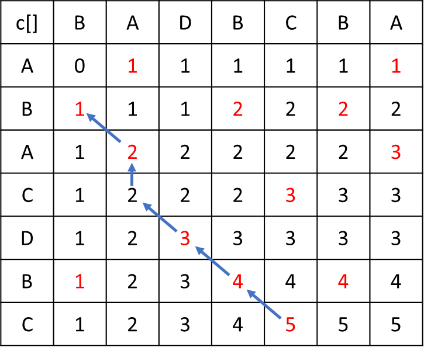

# Algorithmics Homework 5
###### tags: `report` `algorithm`
```
第 7 組
資工二B 109502546 劉語芯
資工二B 109502549 徐瑄琳
資工二B 109502550 許筱敏
資工二B 109502551 葉容瑄
資工二B 109502564 林奕辰
資管二A 109403020 王廷傑
```

### Problem 1

**Exercises 15.3‐5**
Suppose that in the rod-cutting problem of Section 15.1, we also had limit li on the number of pieces of length i that we are allowed to produce, for i = 1, 2, …, n. Show that the optimal-substructure property described in Section 15.1 no longer holds.


hint：
在原本切鋼筋的基礎上，增加對相同$l_i$的數量限制


|  length ($l_i$)   |  1  |  2  |  3  |  4  |  5  |  6  |
|:-----------------:|:---:|:---:|:---:|:---:|:---:|:---:|
|      $p(i)$       | 15  | 25  | 30  | 50  | 49  | 60  |
|      $r(i)$       | 15  | 30  | 45  | 60  | 75  | 90  |
|    limit $l_i$    |  3  |  2  |  2  |  1  |  1  |  2  |
| optimal cut point |  -  |  1  |  1  |  -  |  2  |  2  |

根據15-1的演算法，會不斷對小鋼筋做切割，找到每個小問題的最佳解。
切割方式如下：
6=3+3=(1+2)+(1+2)=1+1+1+1+1+1
但加上數量限制後，長度為 1 的數量不能超過三個，所得到的解就不會是最優解。

### Problem 2

**Exercises 15.5‐2**
Determine the cost and structure of an optimal binary search tree for a set of n = 7 keys with the following probabilities:

| i | 0 | 1 | 2 | 3 | 4 | 5 | 6 | 7 |
| -------- | -------- | -------- | -------- | -------- | -------- | -------- | -------- | -------- |
| $p_i$ |  | 0.04 | 0.06 | 0.08 | 0.02 | 0.10 | 0.12 | 0.14 |
| $q_i$ | 0.06 | 0.06 | 0.06 | 0.06 | 0.05 | 0.05 | 0.05 | 0.05 |

- Initial value:$e[i,j]= q_{i-1} \text{ if } j=i-1$
- Recursive function: 
    $e[i,j] = \text{min}_{i\le r\le j}\{e[i,r-1]+e[r+1,j]+w(i,j)\}$,
    $w(i,j)=\sum_{i\le l\le j}p_l + \sum_{i-1\le l\le j}q_l$

| e[] |j = 0 |j = 1 |j = 2 |j = 3 |j = 4 |j = 5 |j = 6 |j = 7 |
| -------- | -------- | -------- | -------- | -------- | -------- | -------- | -------- | -------- |
|i = 1 | 0.06 | 0.28 | 0.62 | 1.02 | 1.34 | 1.83 | 2.44 | 3.12 |
|i = 2 |  | 0.06 | 0.30 | 0.68 | 0.93 | 1.41 | 1.96 | 2.61 |
|i = 3 |  |  | 0.06 | 0.32 | 0.57 | 1.04 | 1.48 | 2.13 |
|i = 4 |  |  |  | 0.06 | 0.24 | 0.57 | 1.01 | 1.55 |
|i = 5 |  |  |  |  | 0.05 | 0.30 | 0.72 | 1.20 |
|i = 6 |  |  |  |  |  | 0.05 | 0.32 | 0.78 |
|i = 7 |  |  |  |  |  |  | 0.05 | 0.34 |
|i = 8 |  |  |  |  |  |  |  | 0.05 |
- Using a array R to record the value which let e[i,j] minimum

| R[] | 1 | 2 | 3 | 4 | 5 | 6 | 7 |
| -------- | -------- | -------- | -------- | -------- | -------- | -------- | -------- |
| 1 | 1 | 2 | 2 | 2 | 3 | 3 | 5 |
| 2 |  | 2 | 3 | 3 | 3 | 5 | 5 |
| 3 |  |  | 3 | 3 | 4 | 5 | 5 |
| 4 |  |  |  | 4 | 5 | 5 | 6 |
| 5 |  |  |  |  | 5 | 6 | 6 |
| 6 |  |  |  |  |  | 6 | 7 |
| 7 |  |  |  |  |  |  | 7 |

- The cost is 3.12 and the structure is:


- Pseudo Code
~~~
w(i, j): 
    weight = q[i-1]
    for r in i to j:
        weight += p[r]+q[r]
    return weight
    
findOptimalBinaryTree(n):
    for i=1 to n: e[i][i-1] = q[i-1]
    for k = 0 to n-1:
        for i = 1 to n:
            break if i+k > n
            j = i + k
            e[i][j] = infinity
            for r=i to j: e[i][j] = min (e[i][j], e[i][r-1] + e[r+1][j] + w(i, j))
            R[i][j] = r when e[i][j] is minimum
    return
            
printOptimalBinaryTree(i, j ,last):
    if i==j: return
    else if last == 0: print R[i][j] + "is the root"
    else if j < last: print R[i][j] + "is the left child of" + last
    else if j > last: print R[i][j] + "is the right child of" + last
    printOptimalBinaryTree(i, R[i][j]-1, R[i][j])
    printOptimalBinaryTree(R[i][j]+1, j, R[i][j])
    return
~~~

<!--
還是跟答案算的不一樣QAQ
答案所在地: https://grandpaperwriters.com/answered-determine-the-cost-and-structure-of-an-optimal-binary-search-tree-for-a-set-of-n-7-keys-with-the-following/
-->

### Problem 3

**Problems 15‐5: Edit distance**
Given two sequences x[1..m] and y[1..n] and set of transformation-operation costs, the edit distance from x to y is the cost of the least expensive operation sequence that transforms x to y. Describe a dynamic-programming algorithm that finds the edit distance from x[1..m] to y[1..n] and prints an optimal operation sequence. Analyze the running time and space requirements of your algorithm.
- transformation-operations
    - **Insert** a character into x
    - **Delete** a character from x
    - **Replace** a character from x by another character
    - **Twiddle** two adjacent characters from x


題目意思就是要找個演算法把 x sequence 變成和 y sequence 一樣的樣子

- 初始值 $EDIT(x,y,i,j) = 0$ ,i=m & j=n; 
- 遞迴式 
$EDIT(x,y,i,j) = min_{1\le i\le m ,1\leq j\leq n}\{$ 
$cost(Insert)+EDIT(x,y,i,j+1)$,
$cost(Delete)+EDIT(x,y,i+1,j)$,
$cost(Replace)+EDIT(x,y,i+1,j+1)$,
$cost(Twiddle)+EDIT(x,y,i+2;j+2)$, If $i < m - 1$ and $j < n - 1$   and $x[i] = y[j+1]$ and $x[i+1] = y[j]$
}
=$EDIT(x,y,i+1,j+1)$ if $x[i]=y[j]$
= $(n - j) cost(insert)$ if $m = i$
= $(m-i)cost(Delete)$   if $n = j$

- Time complexity $O(mn)$ and Space complexity $O(mn)$

#### top down code:($1\leq i \leq m$ , $1\leq j \leq n$) initialize $\forall_{i, j}dp[i][j]=$inf
```
EDIT(x, y, i, j)
    if dp[i][j]!=inf
        return dp[i][j]
    let m = x.length
    let n = y.length
    if i == m
        return (n - j)cost(insert)
    if j == n
        return (m - i)cost(delete)
    if x[i]==y[j]
        return EDIT(x,y,i+1,j+1)
    o1 = cost(replace) + EDIT(x, y, i + 1, j + 1)
    o2 = cost(delete) + EDIT(x, y, i + 1, j)
    o3 = cost(insert) + EDIT(x, y, i, j + 1)
    if i < m - 1 and j < n - 1
        if x[i] == y[j + 1] and x[i + 1] == y[j]
            o4 = cost(twiddle) + EDIT(x, y, i + 2, j + 2)
    dp[i][j]= min{o1,o2,o3,o4}
    return dp[i][j]
```
#### buttom up code (index start from 1):
```
process dpCost(i, j)
    if i == m
        return (n - j)cost(insert)
    else if j == n
        return (m - i)cost(delete)
    else return dp[i][j]

process Edit()
    for i from m to 1
        for j from n to 1
            minimal = inf
            if X[i]==Y[j]
                minimal = dpCost(i + 1, j + 1)
            minimal = min(cost(insert)+dpCost(i, j+1), minimal)
            minimal = min(cost(replace)+dpCost(i+1,j+1),minimal)
            minimal = min(cost(delete)+dpCost(i+1, j), minimal)
            if i!=m-1 and j!=n-1 and X[i+1]==Y[j] and X[i]==Y[j+1]
                minimal = min(cost(twiddle)+dpCost(i+2, j+2),minimal)
            dp[i][j]=minimal
    return dp[0][0]
            
```

### Problem 4

**Find out all LCS of《BADBCBA》and《ABACDBC》**

- Initial value: $c[i,j]= 0 \text{ if } i=0\text{, or } j = 0$
- Recursive function: 
    $\begin{split}c[i,j]&=c[i-1,j-1]+1\text{ if } i, j \gt 0 \text{ and } x_i = y_j\\ 
    &=\max(c[i,j-1],c[i-1,j])\text{ if }i,j\gt 0 \text{ and }x_i\ne y_j\end{split}$
- 由以上可得圖表：


    $\Rightarrow$ LCS : BADBC; length: 5
- Pseudo Code
~~~
findLCS(str1, str2):
    for i=0 to str1.len:
        for j=0 to str2.len:
            if i==0 or j==0: c[i][j] = 0
            if str1[i] == str2[j]: c[i][j] = c[i-1][j-1]+1
            else c[i][j] = max(c[i][j-1], c[i-1][j])
    return c[str1.len][str2.len]
            
printLCS(c, str1, str2, i, j):
    if i!=0 && j!=0:
        if X[i] == Y[j]:
            printLCS(c, str1, str2, i-1, j-1)
            print(X[i])
        else if c[i-1, j] >= c[i, j-1]: printLCS(c, str1, str2, i-1, j)
        else printLCS(c, str1, str2, i, j-1)
    return
~~~

### Problem 5 

**An algorithm to solve the LCS problem of two strings X and Y has space complexity $O(|X||Y|)$ typically.**
a. Design an algorithm to find the length of LCS of two string X and Y just using only $2\cdot \min(|X|,|Y|)$ cells for working space.
b. Design an algorithm to find the length of LCS of two string X and Y just using only $1+\min(|X|,|Y|)$ cells for working space.

note: index start from 0
- a
    - $dp[2][min(|X|, |Y|)]\rightarrow \text{working space}=2⋅min(|X|, |Y|)$
    - $\text{i denote index for bigger one of X and Y, j denote index for smaller one of X and Y}$
    - $\text{initial case}:\forall_{j} dp[1][j]=0$
    - $\text{recursive form}:\forall_{j=0}$
        - $\text{if bigger[i]==smaller[j]: }dp[i\%2][0]=1$
        - $\text{else: }dp[i\%2][0]=dp[(i+1)\%2][0]$
    - $\text{recursive form}:\forall_{1\le j}$
        - $\text{if bigger[i]==smaller[j]: }dp[i\%2][j]=dp[(i+1)\%2][j-1]+1$
        - $\text{else: }dp[i\%2][j]=max(dp[(i+1)\%2][j], dp[i\%2][j-1])$
```
process lcs_len_2minMN(X, Y)
    if |X|>|Y| swap(X, Y)//make X the smaller string
    initialize dp as array with size (2, |X|)
    dp[1][j]=0 for j = 0 to |X|-1
    for i from 0 to |Y|-1
        for j from 0 to |X|-1
            if j==0 dp[i % 2][j] = 0
            else dp[i % 2][j] = dp[(i + 1) % 2][j - 1]
            if X[j]==Y[i] dp[i % 2][j] += 1
            else if j==0 dp[i % 2][j] = dp[(i + 1)%2][j]
            else dp[i % 2][j] = max(dp[i%2][j - 1], dp[(i + 1)%2][j])
    return dp[(|Y| - 1) % 2][|X| - 1]
```
- b
    - $dp[min(|X|, |Y|)], prev\rightarrow \text{working space}=1+min(|X|, |Y|)$
    - $\text{i denote index for bigger one of X and Y, j denote index for smaller one of X and Y}$
    - $\text{initial case}:dp[0]=0$
    - $\text{recursive form}:\forall_{j=0}$
        - $\text{if bigger[i]==smaller[j]: }(prev, dp[0])=(dp[0], max(dp[0], 1))$
    - $\text{recursive form}:\forall_{1\le j}$
        - $\text{if bigger[i]==smaller[j]: }(prev, dp[j])=(dp[j],  prev+1)$
        - $\text{else: }(prev, dp[j])=(dp[j], max(dp[j], dp[j-1])$
```
process lcs_len_minMNadd1(X, Y)
    if |X|>|Y| swap(X, Y)//make X the smaller string
    initialize dp as array with size |X|, prev as int
    dp[0] = 0
    for i from 0 to |Y|-1
        for j from 0 to |X|-1
            if j==0 prev = 0
            if (X[j]==Y[i]) prev += 1
            else if j==0 prev = dp[j]
            else prev = max(dp[j-1], dp[j])
            swap(dp[j],prev)
    return dp[|X| - 1]
```
<!-- 
嗨
嗨一你的函示名好長
哈哈但我不知道要怎麼表示因為題目分兩種
這樣看起來比較好嗎
但寒士不能數字開頭QQ
然後我的遞迴式也不知道怎麼寫比較好
lcs_len_2minMN讚感恩哈哈
lcs_len_minMNadd1 好醜喔
加一不知道怎麼寫比較好p1?XD比這個好多了
 -->

### Problem 6 

**String Alignment**
Let $\sigma$ be an alphabet set, $\beta$ denote the blank character in $\sigma$, and a measure function $F: \sigma\times\sigma \to R$. Where F is defined as followings, for any x and y in $\sigma$, $F(x, y) \lt 0$ if $x\ne y$ and $F(x, y)\gt 0$ if $x=y$; whereas $F(\beta,\beta)=-\infty$. Given X and Y be two strings of $\sigma^*$, let $X’$ and $Y’$ denote two new strings made by inserting some $\beta$ into $X$ and $Y$ respectively. The similarity of $X$ and $Y$ is defined by measuring the maximal value of $\sum_{a_i\in X,\ b_i\in Y}F(a_i, b_i)$ among all possible $X’$ and $Y’$.
a. Design an algorithm to find the similarity of $X$ and $Y$.
b. Design an algorithm that describe where the blank characters are inserted to get the similarity.

題目：有字串XY，插入空白到XY產生X'Y'對比XY相似度
$F(x, y) \lt 0$ if $x\ne y$ and $F(x, y)\gt 0$ if $x=y$; whereas $F(\beta,\beta)=-\infty$.

a.找XY相似<!--[這個解釋我比較看得懂](https://blog.csdn.net/u013480600/article/details/40785255) [或這個](https://blog.csdn.net/qq_25202231/article/details/72919268)-->
$\text{init: }dp[|X|][|Y|]=0, dp[0][0]=0, dp[i][0]和dp[0][i]$為X和Y前i個字對應空格的分數。
<!--$dp[i][j] = max(dp[i - 1][j - 1] + F(X[i], Y[j]),\\
dp[i - 1][j] + F(X[i], β), \\
dp[i][j - 1] + F(Y[j], β));$-->
$dp[i][j] =max\left\{ 
  \begin{array}{c}
    max(dp[i - 1][j - 1] + F(X[j], Y[i]),\\
    dp[i - 1][j] + F(X[i], β), \\
    dp[i][j - 1] + F(Y[j], β))
  \end{array}
\right.$

~~~
func findSimilarity(X, Y): void
    for i=0 to |X||Y|
        dp[0][i] = F(X[:i],blank)//
        dp[i][0] = F(Y[:i],blank)
    for i=1 to Y.len()
        for j=1 to X.len()
            dp[i][j] = max(dp[i-1][j-1]+F(Y[i],X[j]), 
                           dp[i-1][j]+F(X[i],blank), 
                           dp[i][j-1]+F(Y[j],blank))
    print dp[|X|][|Y|] 
~~~


b.找出哪裡要插空白
- 向左找：Y加空白Xpush，向上找：X加空白Ypush，左上：XY都push
- 如果找到ij都為0了就不再call function
- call withBlank(|Y|,|X|)
- 最後會整理好兩個vector：加好空白的XY
~~~            
func withBlank(i,j):
    if X[j] == Y[i]
        if(i != 0 & j != 0)withBlank(i-1, j-1)
        Xblank.push(X[j])
        Yblank.push(Y[i])
    else if dp[i][j-1] == dp[i][j] +F(Y[j-1]), blank)
        if(i != 0 & j != 0)withBlank(i, j-1)
        Xblank.push(X[j])
        Yblank.push(" ")
    else 
        if(i != 0 & j != 0)withBlank(i-1, j)
        Yblank.push(Y[i])
        Xblank.push(" ")
~~~


<!--ref:

-->

### Problem 7

**Exercises 15.4‐2**
Give pseudocode to reconstruct an LCS from the completed c table and the original sequences $X = <x_1, x_2,\dots ,x_m>$ and $Y = <y_1, y_2,\dots,y_n>$ in $O(m + n)$time, without using the b table.


題目翻譯：在$O(m+n)$的時間內根據建好的表重建LCS

```
printLCS(c, X, Y, i, j):
	if i!=0 && j!=0:
		if X[i] == Y[j]:
			printLCS(c, X, Y, i-1, j-1)
			print(X[i])
		elif c[i-1, j] >= c[i, j-1]:
			printLCS(c, X, Y, i-1, j)
		else
			printLCS(c, X, Y, i, j-1)
	return
```