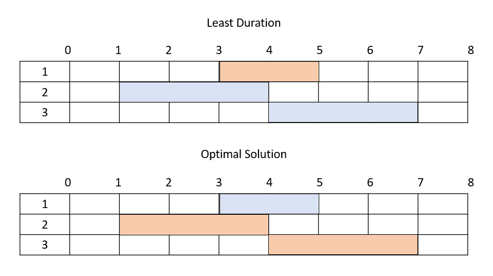
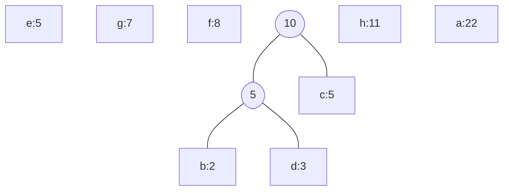

# Algorithmics Homework 6
###### tags: `report` `algorithm`
```
第 7 組
資工二B 109502546 劉語芯
資工二B 109502549 徐瑄琳
資工二B 109502550 許筱敏
資工二B 109502551 葉容瑄
資工二B 109502564 林奕辰
資管二A 109403020 王廷傑
```

### Problem 1

Suppose that in the rod-cutting problem of Section 15.1, we also had limit $l_i$ on the number of pieces of length $i$ that we are allowed to produce, for $i = 1, 2, …, n$. Design a DP algorithm for this problem.


- `i` denotes the length of cutted rod
- `l[i]` denotes the maximum number of rods of length `i`
- `p[i]` denotes the price of each rod of length `i`
- `n` denotes the length of the origin rod

#### recursive function
- version 1
$\left\{
\begin{matrix}
r_0 = 0\\
r_k = max_{1\le i\le n,
            \ i\le k\le n,
            \ 1\le j\le min(l_i,\frac ki)}
        \{r_k, r_{k-i\cdot j}+j\cdot p_i\}
\end{matrix}
\right.$
- version 2
$\left\{
\begin{matrix}
r_0 = 0\\
r_k = max_{1\le i\le n,
            \ 1\le j\le min(l_i,\frac ni),
            \ i\cdot j\le k\le n}
        \{r_k,r_{k-i}+p_i\}
\end{matrix}
\right.$

#### pseudocode
- 使用長度$\le$`i`的鋼筋，總長度不超過`k`，只使用`j`段長度`i`鋼筋的最大利益
```
limited_rod_cutting(n)
    r[n] = {0}
    for i = 1 to n
        for k = n to i
            for j = 1 to l[i] && i*j<=k
                r[k] = max(r[k], r[k-i*j] + j*p[i])
    return r[n]
```
- 將所有鋼筋按照長度一段一段排好，依次迭代，計算最大利益
```
limited_rod_cutting(n)
    r[n] = {0}
    for i = 1 to n
        for j = 1 to min(l[i], n/i)
            for k = n to i*j
                r[k] = max(r[k], r[k-i] + p[i])
    return r[n]
```

#### complexity
- space: $O(n)$
- time: $O(n^2\lg n)$
    - prove ( version 2 )
        $\int_1^n\int_1^{n/i}\int_{i\cdot j}^n dkdjdi\\
        = \int_1^n\int_1^{n/i} n - ij\ djdi\\
        = \int_1^n nj - \frac12ij^2 \bigg|_1^{n/i} di\\
        = \int_1^n\dfrac{n^2}i - \dfrac{n^2}{2i} - n +\dfrac i2 di\\
        = \int_1^n\dfrac{n^2}{2i} - n +\dfrac i2 di\\
        =\frac12 n^2\ln i - ni +\frac14i^2\bigg|_1^n\\
        =\frac12 n^2\ln n - n^2 +\frac14n^2 + n -\frac14\\
        =\frac12 n^2\ln n -\frac34n^2 + n -\frac14\\
        =O(n^2\lg n)$
<!--  -->


### Problem 2

Not just any greedy approach to the activity‐selection problem produces a maximum‐size set of mutually compatible activities. Give an example to show that the approach of selecting the activity of least duration from among those that are compatible with previously selected activities does not work. Do the same for the approaches of always selecting the compatible activity that overlaps the fewest other remaining activities and always selecting the compatible remaining activity with the earliest start time.

- Give a counter example for the following cases to show that they don't work.
- Orange region denotes that we chooce the activity as part of our solution
---
- minimum $f_i-s_i$

    - least duration: {1}
    - optimal solution: {2, 3}
- minimum $|N[i]|$


    - overlaps the fewest other remaining activities: {1, 2, 3}
    - optimal solution: {2, 3, 4, 5}
- minimum $s_i$

    - earliest start time: {1}
    - optimal solution: {2, 3}

### Problem 3

Consider a modification to the activity-selection problem in which each activity $a_i$ has, in addition to a start and finish time, a value $v_i$. The objective is no longer to maximum the number of activities scheduled, but instead to maximize the total value of the activities scheduled. That is, we wish to choose a set $A$ of $\sum_{a_k\in A}v_k$ compatible activities such that is maximized. Give a polynomial-time algorithm for this problem. (Hint: refer to Exercise 16.1-1)

- Idea
    1. Sorting finish time
    2. loop:
        compare the value include $a_i$ and the value exclude $a_i$
        the maximum one be the optimal case in i
    3. initial case: `opt[0] = v[0]`
    4. recursive function:
        opt[i] = max(opt[i-1], v[i]+opt[j]), j is the largest one in the set of f[j]<=s[i]
- Pseudo Code
~~~
findMaxValue(n):
    f[],s[] <- finish time and start time of a[] after ascending sorting finish time
    opt[0] = v[0]
    for i=1 to n-1:
        exclValue = opt[i-1]
        inclValue = v[i]
        for j=i-1 to 0:
            inclValue += opt[j] if f[j]<=s[i] 
            break
        opt[i] = max(exclValue, inclValue)
    return opt[n-1]
~~~

- Time Complexity
    The time complexity is $O(n^2)+T(\text{sorting})$.
    If choose the sorting which spend less than $O(n^2)$, the time complexity will be $O(n^2)$

- 參考資料
    - [16.1-1](https://walkccc.me/CLRS/Chap16/16.1/)
    - [Weighted Job Scheduling](https://www.geeksforgeeks.org/weighted-job-scheduling/)
    - [PPT](https://cs.slu.edu/~holdener/fall2018/csci3100/slides/csci3100_day13.pdf)


### Problem 4

Given a 0-1 knapsack problem with the knapsack size $K$ and $n$ items, where each item has its weight in integer and its value in real.
a. Design an algorithm to find the most valuable load of the items that fit into the knapsack.
b. Design a pseudo-polynomial time algorithm to determine the optimal solution that the total weight **exactly equals** to $K$.

#### a.
1. Create a matrix M[n+1][K+1],$M[i][j]=$給定item[0,i]以及給定背包容量 j 下能裝物品最高價值,$M[0][j]=0$ , $i$為 i-th item , $w_i$為 i-th weight。初始值為$i=0$
2. 遞迴式
$M[i][j]$
$=0$  (if i = 0)
$=M[i-1][j]$ (if $w_i>j$)
$=max_{1 \leq i \leq n,1\leq j\leq K}(M[i-1][j],v_i+M[i-1][j-w_i])$ (otherwise)
3. Time complexity = $O(nK)$ ,K is a value so time complexity is pseudo-polynomial
##### Pseudo code 
n為物件數目,v為value table,w為weight table。
```
knapsack0_1(n,v,w,K)
    for i = 0 to n
        for j = 1 to K
            if i==0
                M[i][j]=0
            if(w[i]>j)
                M[i][j] = M[i-1][j]
            else
                M[i][j] = max(v[i]+M[i-1][j-w[i]],M[i-1][j])
    return M[n][K]
```
#### b.
1. Create a matrix `dp[n+1][K+1]`，定義 `1 =  True, 0 = False`，`dp[i][j]` = 前i個物品"是否"能裝到目標容量`j`。`i`為取前i個item，初始值為dp[0][0] = 1(True),dp[0][k]=0(False)
2. 遞迴式
$dp[i][j]$
=1 (if i=0 and j=0)
=0 (if i=0 and j!=0)
=dp[i-1][j] (if w_i > j )
$=max_{1\leq i\leq n,0\leq j \leq K}(dp[i-1][j],dp[i-1][j-w _i])$
3. Time complexity = $O(nK)$

#### Pseudo code
w為weight table
```
subset_sum(n,K,w)
    for i = 0 to n
        for j = 0 to K
            if i==0
                if j==0
                    dp[i][j] = 1
                else
                    dp[i][j] = 0
            if w[i]>j
                dp[i][j] = dp[i-1][j]
            else
                dp[i][j]= max(dp[i-1][j-w[i]],dp[i-1][j])
    return dp[n][K]
```


### Problem 5

Professor Gekko has always dreamed of inline skating across North Dakota. He plans to cross the state on highway U.S. 2, which runs from Grand Forks, on the eastern border with Minnesota, to Williston, near the western border with Montana. The professor can carry two liters of water, and he can skate m miles before running out of water. (Because North Dakota is relatively flat, the professor does not have to worry about drinking water at a greater rate on uphill sections than on flat or downhill sections.) The professor will start in Grand Forks with two full liters of water. His official North Dakota state map shows all the places along U.S. 2 at which he can refill his water and the distances between these locations.
The professor’s goal is to minimize the number of water stops along his route across the state. Give an efficient method by which he can determine which water stops he should make. **Prove** that your strategy yields an optimal solution, and give its running time.

- 題目翻譯：
某教授一次最多可以攜帶 2L 的水，並且在水喝完之前前進 m 英里。地圖上標示出了所有可以進行補水地點的位置與兩點間距離，目標是停下來補水的次數越少越好，要找到哪些點他應該停下來補水。
- 方法
    - 假設一共有n個點可供補水，補完水後最多可以再走ｍ英里
    - 利用陣列紀錄每個點之間的距離 distance[n+1]
    - 找到接下來ｍ距離內最遠的點進行補水
- DP（遞迴式）
    - 設有 $n$ 個補水站（$r_i...r_n$），最優解有 $k$ 個補水點（$x_1...x_k$）
    - $𝑥_1=max⁡\{𝑟_𝑖;𝑟_𝑖<𝑚\}$
    - $𝑥_𝑗=max⁡_{1<j\le n}\{𝑟_𝑖;0<𝑟_𝑖−𝑥_{𝑗−1}<𝑚\}$

- pseudo code
    - dis[0]=0, dis[1~n]=distance between location
    - distance 記錄距離上個補水點的距離
    - refill 記錄補水點的位置
```
refill_water:
    dis[n+1], refill[n]
    distance = 0, index = 1
    for i = 1 to n+1:
        distance = distance + dis[i]
        if(distance > m):
            refill[index++] = i-1
            i--
            distance=0
return refill
```
- prove
If we don't refill water at the farest location within $m$ miles, we may have to refill water more times.
- Example: 
    - Orange points denotes the locations we stop and refill water.
    - Set $m=5$


- time complexity: $O(n)$

### Problem 6

Show how to solve the fractional knapsack problem in $O(n)$ time.

- fractional knapsack problem
$\text{I is the set of items, each item } i \in I \text{ has attribute }i_p \text{ and } i_w \text{ denote price and weight of }i\\
\text{find the maximal price in every possible picking choices that sum of weight }\le W\\
\text{with any item can be seperate with pratition [0, 1]}$

- algorithm with time $O(n)$
    1. $\text{input: I as the item set and W as the maxmimal weight}$
        $\text{output: A as the answer item set}$
    3. $\text{select the middle item with respect to the price/weight in an item set I}$
        $\text{seperate I into three subsets }I_1, I_2, I_3$
        $I_1=\{i|i\in I\wedge \frac{i_p}{i_w}>\frac{s_p}{s_w}\}, W_1=\sum_{i\in I_1}\limits i_p$
        $I_2=\{i|i\in I\wedge \frac{i_p}{i_w}=\frac{s_p}{s_w}\}, W_2=\sum_{i\in I_2}\limits i_p$
        $I_3=\{i|i\in I\wedge \frac{i_p}{i_w}<\frac{s_p}{s_w}\}, W_3=\sum_{i\in I_3}\limits i_p$
    3. 
        1. $\text{if }W_1+W_2+W_3\le W\\
        \Rightarrow \text{return }A=I$
        2. $\text{if }W_1+W_2+W_3\ge W\wedge W_1+W_2\le W\\
        \Rightarrow \text{return }A=I_1\cup I_2\cup \{\text{repeat 2. with }I=I_3, W=W-(W_1+W_2)\}$
        3. $\text{if }W_1\le W\wedge W_1+W_2\ge W\\
        \Rightarrow \text{return }A=I_1\cup \{\text{modify }I_2 \text{ to sum_of_weight=}W-W_1\}$
        4. $\text{if }W_1>W\\
        \Rightarrow \text{return }A=\{\text{repeat 2. with }I=I_1, W=W\}$

- time analysize
    The process return if the scenario goes into 3.1 or 3.3, so the best case to do this algorithm is $O(n)$ if the first time doing 2. goes into 3.1 or 3.3. Picked item $s$ cut $I$ into half so when scenario alwats goes into 3.2 or 3.4, the number of item in the subproblem goes into half while 1. takes 2*n time, so the average time of this algorithm can be write as following form $$T(n) = 2n+T(n/2)$$ Therefore the time complexity is $4n=O(n)$

### Problem 7

Generalize Huffman's algorithm to ternary codewords (i.e., codewords using the symbols `0`, `1`, and `2`), and prove that it yields optimal ternary codes.

1.和原本的霍夫曼一樣，為strict tree，一個node底下只能有三個點或零個點。
2.觀察：當原始個數為偶數個時，會無法建strict ternary tree, 並且只差一個點就可以建好，所以當點為偶數個的時候，要塞一個dummy node.

```
HUFFMAN_TERNARY(C)
{
    if (|C| == EVEN) C.add(fre=0,ch=dummy)
    Q <- C    //Q:priority queue
    while(|Q|>1)
    {
        z <- Allocate-Node()
        left[z]  <- w <-Extract-Min(Q)
        mid[z]   <- x <-Extract-Min(Q)
        right[z] <- y <-Extract-Min(Q)
        f[z] = f[w]+f[x]+f[y]
        insert(Q, z)
    }
    return Extract-Min(Q);
} 
```
<!--


[參考資料](https://stackoverflow.com/questions/29200112/do-we-have-to-create-a-tree-all-the-nodes-of-which-have-3-children)
[準備參考的proof](http://www.cs.utoronto.ca/~brudno/csc373w09/huffman.pdf)

-->
#### Proof of Optimality
- Lemma1: Let T be a tree for some f and A, and let w, y be two leaves. Let $T'$ be the tree obtained from T by swapping y and w. Then $WEPL(T')−WEPL(T) =(f(y) − f(w))(depth(w, T) − depth(y, T))$.
    - Proof
$WEPL(T') − WEPL(T) = f(y)\ depth(w, T) + f(w)\ depth(y, T) − f(w)\ depth(w, T) − f(y)\ depth(y, T)$
$= f(y)(depth(w, T) − depth(y, T)) + f(w)(depth(y, T) − depth(w, T))$
$= (f(y) − f(w))(depth(w, T) − depth(y, T)$
<!--- Lemma2: Any optimal tree has the lowest three frequencies at the lowest level.
        - if we change a larger frequence with a lower one:
        - observation(graph below)
Then we can get WEPL(weighted external path length):
WEPL(T1): $3*3+7*2+11*1=34$
WEPL(T2): $8*3+7*2+6*1=44$
We can easily conclude that if the lowest three frequencies are not at the lowest level, this algorithm will not be optimal.-->

WEPL(T1): $3*3+7*2+11*1=34$

WEPL(T2): $8*3+7*2+6*1=44$
We can easily conclude that only the lowest three frequencies are  at the deepest level, this algorithm will be optimal(in any ternary tree or subtree).So based on this conclusion, a huffman tenary tree will yield optimal tenary code.


### Problem 8

Find the Huffman codes of the data given below by drawing the tree like the figure 16.5 in the page 432. You should write down each step of the Huffman’s algorithm.

a:22 b:2 c:5 d:3 e:5 f:8 g:7 h:11

0. a:22 b:2 c:5 d:3 e:5 f:8 g:7 h:11


1. b:2 d:3 c:5 e:5 g:7 f:8 h:11 a:22


2. bd:5 c:5 e:5 g:7 f:8 h:11 a:22

3. e:5 g:7 f:8 bcd:10 h:11 a:22

4. f:8 bcd:10 h:11 eg:12 a:22

5. h:11 eg:12 bcdf:18 a:22

6. bcdf:18 a:22 egh:23

7. egh:23 abcdf:40

8. abcdefgh:63

