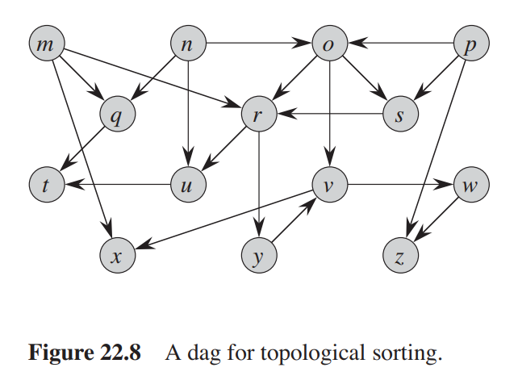
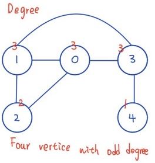
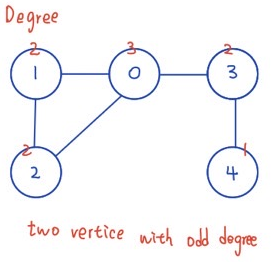

# Algorithmics Homework 8
###### tags: `report` `algorithm`
```
第 7 組
資工二B 109502546 劉語芯
資工二B 109502549 徐瑄琳
資工二B 109502550 許筱敏
資工二B 109502551 葉容瑄
資工二B 109502564 林奕辰
資管二A 109403020 王廷傑
```

### Problem 1

Given an adjacency-list representation of a directed graph, how long does it take to compute the out-degree of every vertex? How long does it take to compute the in-degrees?

Given an adjacency-list representation Adj of a directed graph
- out-degree
    - the outdegree of a vertex u is equal to the length of Adj[u]
    - the sum of the lengths of all the adjacency lists in Adj is |E|.
    -  Thus the time to compute the out-degree of one vertex
is $\Theta(|Adj(v)|)$ and for all vertices is $\Theta(V + E)$.
- in-degree
    - Time Complexity : $\Theta(VE)$
        - The in-degree of a vertex u is equal to the number of times it appears in all the lists in Adj. 
        - If we search all the lists for each vertex, the time to compute the in-degree of all vertices is $\Theta(VE)$. 
    - Time $\Theta(V + E)$ + Space $\Theta(V)$
        - Alternatively, we can allocate an array T of size |V| and initialize its entries to zero. 
        - Then we only need to scan the lists in Adj once, incrementing $T[u]$ when we see u in the lists. The values in T will be the in-degrees of every vertex. This can be done in $\Theta(V + E)$ time with $\Theta(V)$ additional storage.
<!--
感謝gooooooogle https://tildesites.bowdoin.edu/~ltoma/teaching/cs231/fall09/Homeworks/old/rest/H10-sol.pdf
第一題可參考^^
-->


### Problem 2

The transpose of a directed graph $G = (V, E)$ is the graph $G^T = (V, E^T)$, where $E^T = { (v, u) \in V \times V : (u,v) \in E }$. Thus, $G^T$ is $G$ with all its edges reversed. Describe efficient algorithms for computing $G^T$ from $G$, for both the adjacency-list and adjacency-matrix representations of $G$. Analyze the running times of your algorithms.

#### adjacency-matrix
- Idea
    1. In adjacency-matrix $A_{n \cdot n}$, $a_{ij}$ represents $v_i, v_j \in V, \exists a_{ij}$ of edges from $v_i$ points to $v_j$.
    2. In $G^T$, we reverse all edges $\in G$.
    3. $adj(G^T) = (adj(G))^T = A^T$
- pseudo code
```
A[n,n] // adjacency-matrix of G

transpose_by_matrix(A[n,n]):
    for i = 1 to n :
        for j = i+1 to n:
            swap(A[i][j], A[j][i]);

```
- analysis
    - time complexity: $\dfrac12 n^2 = O(n^2)$

#### adjacency-list
- Idea
    - for each $u$ , if there exists $v$ that $(u,v) \in E$, add $(v,u)$ to $E^T$

- pseudo code
```
E[n] // adjacency-list of G

transpose_by_list(E[n]):
    E_t[n] <- all vertex point to null
    for u in E[]:
        v = u->next
        while v!=null :
            create_edge(E_t[v], u)
            v = v->next
    return E_t

    
create_edge(E_t[v], u):
    node(u, null)
    node->next = E_t[v]->next
    E_t[v]->next = node
    return
```
- analysis
    - time complexity: $O(n+m)$


### Problem 3

The square of a directed graph $G = (V, E)$ is the graph $G^2 = (V, E^2)$ such that $(u, v) \in E^2$ if and only if $G$ contains a path with at most two edges between $u$ and $v$. Describe efficient algorithms for computing $G^2$ from $G$ for both the adjacency-list and adjacency-matrix representations of $G$. Analyze the running times of your algorithms.

**adjacency-list**
- IDEA
    - 透過 adjacency-list，我們能找到每個 vertex $u_i$ 的 adjacent vertex $v_j$，將 $(u_i, v_j)$ 加入 $G^2$ 之中 
    - 再找到 $v_j$ 的 adjacent vertex $w_k$，將 $(u_i, w_k)$ 加入 $G^2$ 之中
        - time complexity: $O(EV)$
            > 透過 $w$ 找到每個 edge $(u, v)$ 的相鄰 edge $(v, w)$
            > V: vertex 數量，E: edge 數量
        - 因為不同的 vertex $v_j$ 可能會連到相同的 vertex $w_k$，所以我們需要刪除重複的 edge $(u_i, w_k)$
            - time complexity: $O(V+VE)$

- Pseudo Code
```
findAdjacencyList:
    for u in G.vertex
        for v in G.adj[u]
            add (u, v) to G2.E2
            for w in G.adj[v]
                add (u, w) to G2.E2
    removeDuplicates
    
removeDuplicates:
    A[] <- size V, initialized with 0
    G_ans <- adjacency-list
    for u in G2.vertex
        for v in G2.adj[u]
            if v!=u && A[v]!=u
                A[v]=u
                insert(G_ans[u], v)
    return G_ans
```
- Time Complexity = $O(EV)+O(V+VE)=O(EV)$

**adjacency-matrix**
- IDEA
矩陣 $A$ 表示 $G$ 的 adjacency matrix
當 $A^2$ 的 element $A_{ij}$ 為 1 時，表示 vertex $i, j$ 之間共有2個edges
題目要求最多 2 個 edges
故所求為 $A+A^2$
- pseudo code
```
findAdjacencyMatrix:
    calculate A*A // use library 
    return A+A*A
```
- time complexity: 計算矩陣乘法的時間複雜度
    - 最基礎的算法為 $O(V^3)$
    - Strassen's algorithm $O(𝑉^{\lg⁡ 7})$

參考
https://quizlet.com/explanations/questions/the-square-of-a-directed-graph-g-v-e-is-the-graph-g2-v-e2-such-that-u-v-e290c88c-1295-4695-bfc5-d0e524818bb0

### Problem 4

There are two types of professional wrestlers: “babyfaces” (“good guys”) and “heels” (“bad guys”). Between any pair of professional wrestlers, there may or may not be a rivalry. Suppose we have $n$ professional wrestlers and we have a list of $r$ pairs of wrestlers for which there are rivalries. Give an $O(n + r)$-time algorithm that determines whether it is possible to designate some of the wrestlers as babyfaces and the remainder as heels such that each rivalry is between a babyface and a heel. If is it possible to perform such a designation, your algorithm should produce it.

- Idea
    - Create a graph $G$: n vertices and r edges
        $\Rightarrow$ 只有兩個顏色的塗色問題
    - Create BFS tree of $G$
    - distance is odd : "babyfaces" ; distance is even : "heels"
    - Check whether each rivalry is between a babyface and a heel
- Pseudo code
```
BFS(G):    //V[] is the set of vertices
    let Q be a queue
    for i=0 to n-1 && V[i].visit==0:
        Q.enqueue(V[i])
        V[i].visit = 1
        V[i].type = "babyfaces"
        while(Q is not empty):
            k = Q.dequeue()
            for j in k.adjList && j.visit==0:
                j.visit = 1
                Q.enqueue(j)
                if(k.type=="babyfaces"):j.type = "heels"
                else j.type = "babyfaces"

Check(V):
    for i=0 to n-1:
        for j=i to n-1 and V[j] in V[i].adjList:
            if(V[j].type==V[i].type) reture false
    reture true
```
- Analysis
    - Time Complexity = T(BFS) + T(Check) = $O(n+r)+O(r)$ = $O(n+r)$
### Problem 5

Give a linear-time algorithm that takes as input a directed acyclic graph $G = (V, E)$ and two vertices s and t, and returns the number of simple paths from s to t in $G$. For example, the directed acyclic graph of Figure 22.8 contains exactly four simple paths from vertex p to vertex v: pov, poryv, posryv, and psryv. (Your algorithm needs only to count the simple paths, not list them.)



- $dp[v]\text{ denote the number of path from v to s}$
- $\text{Initial case: }dp[t]=1, \forall_{v!=t}dp[v]=-1$
- $\text{Recursive form: }\forall_{v\in G.V}dp[v]=\sum_{u\in G.adj[v]}\limits dp[u]$


```python=3
DFS(G, s):
    if dp[s]!=-1: return dp[s]
    dp[s]=0
    for v in G.adj[s]
        dp[s]+=DFS(G, v)
    return dp[s]

CountSimplePaths(G, s, t):
    dp[v]=-1 for v in G.V
    dp[t]=1
    return DFS(G, s)
```

Time complexity: $O(|V|+|E|)$, since DFS take the time of $|V|+|E|$ if gragh is stored with adj list and initialize dp array takes $|V|$ times.

### Problem 6

Give an algorithm that determines whether or not a given undirected graph $G = (V, E)$ contains a cycle. Your algorithm should run in $O(V)$ time, independent of $|E|$.


An undirected graph is acyclic iff a DFS yields no back edges. Since back edges are those edges (u, v) connecting a vertex u to an ancestor v in a depth-first tree, so no back edges means there are only tree edges, so there is no cycle.

So simply run DFS. If find a back edge, there is a cycle. The complexity is $O(V )$ instead of $O(E + V )$. Since if there is a back edge, it must be found before seeing |V| distinct edges. This is because in a acyclic (undirected ) forest, |E| $\le$ |V| - 1

Time complexity :$O(V)$
<!--
https://github.com/gzc/CLRS/blob/master/C22-Elementary-Graph-Algorithms/22.4.md 上面那些字
https://www.geeksforgeeks.org/detect-cycle-undirected-graph/ 我看到的code
 quizlet 獲得ㄉpseudo
-->


### Problem 7

Give an algorithm that determines whether or not a given undirected graph $G = (V, E)$ contains an euler circuit,and if the answer is positive your algorithm should output an euler circuit.


Euler path is a way that uses every edge of a graph exactly once
Euler circuit is a circuit that uses every edge of a graph exactly once , starts and ends in the same vertice.


#### Euler path
- All vertices with non-zero degree are connected. 
- If zero or two vertices have odd degree and all other vertices have even degree.
  Prove:
      The graph is not Eulerian 
  
       The graph has Euler path

####  Euler circuit 

-  All vertices with non-zero degree are connected. 
-  All vertices have even degree.
   Prove:
   In Eulerian path, each time we visit a vertex v, we walk through two unvisited edges . Therefore, all middle vertices in Eulerian Path must have even degree. 
   For Eulerian Cycle, any vertex can be middle vertex, therefore all vertices must have even degree.
#### Time complexity  O(E)
參考資料：
https://www.geeksforgeeks.org/hierholzers-algorithm-directed-graph/
  
#### Pseudo Code
V為vertice數目，DFSUtil()為Depth-First Search，adj[i]為vertice i 的adjacency list , d[i]為 vertice i 之degree 
```
isConnected(V):bool
    for i = 0 to V
        visited[i] = false
    DFSUtil(i, visited)         //DFSUtil會把遍歷過的visited[vertice]改成true
    for i = 0 to  V
       if (visited[i] == false)
            return false
    return true
```
```
isEulerian():bool
    if isConnected() == false
        return false;
    for i=0 to V
        if d[i] != even 
            return false
    return true

```
Create two stack : temp , res
```
printEulerCircuit(u):
    push u to temp
    while(!temp.empty())
        u = temp.top()
        if all edges from u are visited
            temp.pop()
            res.push(u)
        else
            find v which is connected from u
            temp.push(v)
            remove edge(u,v) from the graph
    print(res)
```