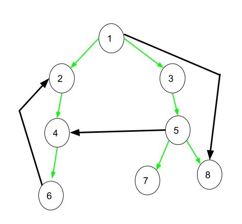

# Algorithmics Homework 9
###### tags: `report` `algorithm`
```
第 7 組
資工二B 109502546 劉語芯
資工二B 109502549 徐瑄琳
資工二B 109502550 許筱敏
資工二B 109502551 葉容瑄
資工二B 109502564 林奕辰
資管二A 109403020 王廷傑
```

### Problem 1

A DFS forest can be generated by perform DFS on a directed graph. There are 4 types of edges in a DFS forest: tree edge, forward edge, back edge and cross edge.
Modify DFS so that it can determine the type of each edge.

#### Pseudo code

```
DFS(G):
Initially set c[u] <- white for each u ∈ V
count <- 0
for each u ∈ V do if c[u] = White then Visit(u)
```
```
Visit(u)
c[u] <- Gray
d[u] <- ++count
for each v ∈ Adj[u]do
    if c[v] = White
        print( (u->v) is Tree Edge )
        Visit(v)
    if c[v] = Gray
        print( (u->v) is Back Edge )
    if c[v] = Black and d[u] < d[v]
        print( (u->v) is Forward Edge )
    if c[v] = Black and d[u] > d[v]
        print( (u->v) is Cross Edge )
c[u] <- Black
f[u] <- ++count
```
<!--
參考資料:
https://alrightchiu.github.io/SecondRound/graph-depth-first-searchdfsshen-du-you-xian-sou-xun.html
-->


### Problem 2

Show how the procedure STRONGLY-CONNECTED COMPONENTS works on the graph of Figure 22.6. Specifically, show the finishing times computed in line 1 and the forest produced in line 3. Assume that the loop of lines 5-7 of DFS considers vertices in alphabetical order and that the adjacency lists are in alphabetical order.


<!-- 

 -->
- time
    - q-s-v-w-w-v-s-t-x- z---z---x---y---y---t---q---r---u---u---r
    - 1-2-3-4-5-6-7-8-9-10-11-12-13-14-15-16-17-18-19-20

- finish time
    - r:20 u:19 q:16 t:15 y:14 x:12 z:11 s:7 v:6 w:5
- Tree


### Problem 3

A directed graph $G = (V, E)$ is semiconnected if, for all pairs of vertices $u, v \in V$, we have u ~> v or v ~> u. Give an efficient algorithm to determine whether or not G is semiconnected. Prove that your algorithm is correct, and analyze its running time.


#### Algorithm
1. Run strongly-connected-componment($G$)
2. Take each strong connected component as a virtual vertex and create a new virtual graph $G'$
3. Run topological-sort($G'$)
4. Check if for any consecutive vertices ($v_i, v_{i+1})$ in a topological sort of $G'$, there is an edge $(v_i, v_{i+1})$ in graph $G'$. If so, the original graph is semiconnected. Otherwise, it isn’t.

#### Proof
$\because G' \in DAG$
$\therefore$ 對於連續兩個點 $(v_i, v_{i+1})$不存在邊$\Leftrightarrow(v_i, v_{i+1})$沒有 direct path
又因為 $(v_i, v_{i+1})$沒有邊且$G'\in DAG$
$\Rightarrow (v_{i+1}, v_i)$ 一定沒有邊
所以兩點一定沒有邊

#### Time complexity
$T = T(SCC) + T(TopoSort) = O(|V| + |E|)$

### Problem 4

在投影片 Unit 7 P.39 的地方有提到另一個 DFS 的實作，但其輸出的 order 可能會不同，試問該DFS的實作是否可以用來解Topological Sorting以及Strongly Connected-Components?


- Topological Sorting 
    - 等到 u 的 小孩都 DFS 完後才 pop 掉 u
    ```
    visit <- stack store visit vertex (not order)
    leave <- stack store leave order
    public Vertex next():
        if u.color == black:
            w=visit.pop()
            leave.push(w) // 將 u 移到 leave stack 中
        for each v in adj[u]
            if v.color == white:
                v.color = gray
                visit.push(v)
        u.color = black
        return u <- visit order
    ```

- Strongly Connected Component
    - Step 1：找到 leave order
    ```
    visit <- stack store visit vertex (not order)
    leave <- stack store leave order
    u = visit.top()
    public Vertex next():
        if u.color == black:
            w = visit.pop() // w=u
            if(w.out==0) 
                leave.push(u)
                w.out=1 // 記錄是否已經離開 (有環情況)
        for each v in adj[u]
            if v.color == white:
                v.color = gray
                visit.push(v)
        u.color = black
        return u <- visit order
    ```
    - Step 2：$G=G^T$
    - Step 3：find SCC
    ```
    SCC <- stack stored SCC set
    find SCC:
        while(!leave.empty()):
            u = leave.pop():
            if u.out == 0 // 尚未被輸出成 SCC set
                stack.push(u)
                SCC.push(u)
                while(u.next):
                    SCC.push(u.next)
                    u=u.next
                print SCC
                SCC elements.out=1
                SCC.clear()
    
    u.next method:
        u=stack.pop()
        for v in adj[u]
            if v.color==white
                v.color=gray
                stack.push(v)
        return u
    ```
### Problem 5

Show that if an edge(u, v) is contained in some minimum spanning tree, then it is a light edge crossing some cut of the graph.

1. Let T~0~ and T~1~ be two trees by removing (u, v) from the minimum spanning tree.
2. Assume there is an edge whose weight is less than (u, v) and it connects T~0~ and T~1~.
3. Let the new MST contain the edge instead of (u, v).
4. The new MST's weight is less than the original MST.$\rightarrow$contradiction
5. Therefore, edge(u, v) must be a light edge if it is contained in some minimum spanning tree.

<!--hi
hi
--> 

### Problem 6

Let e be a maximum-weight edge on some cycle of connected graph $G = (V, E)$.Prove that there is a minimum spanning tree of $G’ = (V, E – \{ e\} )$ that is also a minimum spanning tree of G. That is, there is a minimum spanning tree of G that does not include e.

1. For any cut that causes the cycle divided into two sides, there must be some edge whose weight is less than or equal to e's weight.
3. To connect two sides, we have to choose the light edge for this cut.
4. If some edges weight is equal to e's weight, we can choose those edges instead of choosing e.
5. Therefore, e isn't a safe edge for G.$\Rightarrow$ MST of G does not include e.

### Problem 7

Show that a graph has a unique minimum spanning tree if, for every cut of the graph, there is a unique light edge crossing the cut. Show that the converse is not true by giving a counterexample.


For any spanning tree of a graph, every edge in the spanning tree is across a cut.
So if there are two minimum spanning trees for a graph, there are two light edges for a cut of the graph$\rightarrow$contradiction.